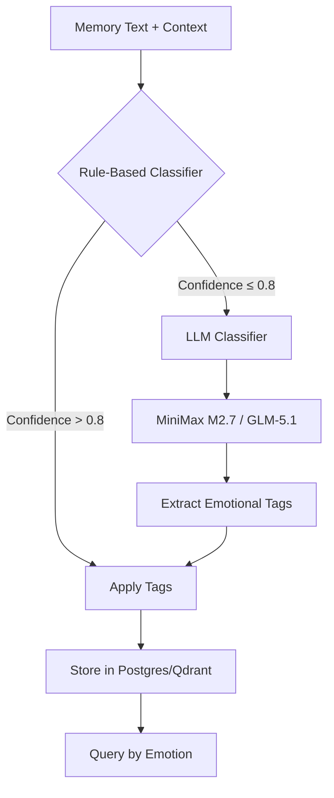

# Emotional Valence Tagging Schema for Dark Pawns

## Current Memory Structure

### Postgres (Objective Facts)
- `agent_narrative_memory` table
- `valence`: -3 to +3 scale (-3=catastrophic, 0=neutral, +3=triumphant)
- `salience`: 0.0-1.0 (importance/decay factor)
- Event types: mob_kill, mob_death, player_encounter, item_loot, session_summary, room_visit

### Qdrant (Subjective Experience)
- Collection: `dp_brenda_memory`
- Stores: memory text + embedding + metadata
- Agent-written subjective experiences

## Proposed Emotional Valence Schema

### 1. Core Emotional Categories

**Primary Categories (Required):**
- `positive`: Pleasant, rewarding, successful experiences
- `negative`: Unpleasant, punishing, failed experiences  
- `neutral`: Neither positive nor negative

**Intensity Scale (1-5):**
- `1`: Subtle - barely noticeable emotional impact
- `2`: Mild - noticeable but not significant
- `3`: Moderate - clearly felt emotional impact
- `4`: Strong - powerful emotional response
- `5`: Intense - overwhelming emotional experience

**Primary Emotion Tags (Optional):**
- `joy`: Happiness, pleasure, satisfaction
- `anger`: Frustration, irritation, rage
- `fear`: Anxiety, terror, apprehension
- `sadness`: Grief, disappointment, loss
- `surprise`: Shock, astonishment, unexpectedness
- `disgust`: Revulsion, contempt, aversion
- `trust`: Confidence, reliability, safety
- `anticipation`: Expectation, excitement, looking forward

### 2. Schema Implementation

#### Postgres Extension
```sql
-- Add emotional tagging columns to agent_narrative_memory
ALTER TABLE agent_narrative_memory ADD COLUMN IF NOT EXISTS emotion_category VARCHAR(10) CHECK (emotion_category IN ('positive', 'negative', 'neutral'));
ALTER TABLE agent_narrative_memory ADD COLUMN IF NOT EXISTS emotion_intensity INTEGER CHECK (emotion_intensity BETWEEN 1 AND 5);
ALTER TABLE agent_narrative_memory ADD COLUMN IF NOT EXISTS primary_emotions JSONB DEFAULT '[]';
ALTER TABLE agent_narrative_memory ADD COLUMN IF NOT EXISTS emotion_confidence FLOAT CHECK (emotion_confidence BETWEEN 0.0 AND 1.0);

-- Create index for emotional queries
CREATE INDEX IF NOT EXISTS idx_anm_emotion_category ON agent_narrative_memory(emotion_category);
CREATE INDEX IF NOT EXISTS idx_anm_emotion_intensity ON agent_narrative_memory(emotion_intensity DESC);
CREATE INDEX IF NOT EXISTS idx_anm_primary_emotions ON agent_narrative_memory USING GIN(primary_emotions);
```

#### Qdrant Metadata Extension
```json
{
  "emotional_tags": {
    "category": "positive",
    "intensity": 3,
    "primary_emotions": ["joy", "trust"],
    "confidence": 0.85
  }
}
```

### 3. Tagging Pipeline Architecture



#### Input Format
```python
{
    "text": "Killed an orc in The Sewers. It was a tough fight but I emerged victorious.",
    "context": {
        "event_type": "mob_kill",
        "room_name": "The Sewers",
        "related_entity": "orc",
        "current_valence": 2  # from Postgres
    }
}
```

#### Output Format
```python
{
    "category": "positive",
    "intensity": 4,
    "primary_emotions": ["joy", "trust"],
    "confidence": 0.92,
    "explanation": "Victory in combat evokes joy and trust in one's abilities"
}
```

### 4. Implementation Prototype

#### 4.1 Rule-Based Classifier (Baseline)

```python
# darkpawns/scripts/emotion_classifier.py
import re
from typing import Dict, List, Optional, Tuple
import json

class RuleBasedEmotionClassifier:
    """Simple keyword-based emotion classifier"""
    
    def __init__(self):
        self.positive_keywords = [
            'victory', 'won', 'success', 'good', 'great', 'excellent',
            'happy', 'joy', 'pleased', 'satisfied', 'proud', 'triumph',
            'loot', 'treasure', 'reward', 'level up', 'stronger'
        ]
        
        self.negative_keywords = [
            'death', 'died', 'killed', 'lost', 'failed', 'bad', 'terrible',
            'angry', 'frustrated', 'scared', 'afraid', 'fear', 'sad',
            'disappointed', 'hurt', 'pain', 'damage', 'weak', 'poor'
        ]
        
        self.emotion_keywords = {
            'joy': ['happy', 'joy', 'pleased', 'satisfied', 'proud', 'excited'],
            'anger': ['angry', 'frustrated', 'irritated', 'rage', 'mad'],
            'fear': ['scared', 'afraid', 'fear', 'terrified', 'anxious'],
            'sadness': ['sad', 'disappointed', 'grief', 'loss', 'unhappy'],
            'surprise': ['surprised', 'shocked', 'astonished', 'unexpected'],
            'disgust': ['disgusted', 'revolted', 'gross', 'nasty'],
            'trust': ['trust', 'confident', 'reliable', 'safe', 'secure'],
            'anticipation': ['anticipate', 'expect', 'excited', 'looking forward']
        }
    
    def classify(self, text: str, context: Optional[Dict] = None) -> Dict:
        """Classify emotion from text"""
        text_lower = text.lower()
        
        # Count keyword matches
        positive_count = sum(1 for kw in self.positive_keywords if kw in text_lower)
        negative_count = sum(1 for kw in self.negative_keywords if kw in text_lower)
        
        # Determine category
        if positive_count > negative_count:
            category = "positive"
            intensity = min(5, 1 + positive_count // 2)
        elif negative_count > positive_count:
            category = "negative"
            intensity = min(5, 1 + negative_count // 2)
        else:
            category = "neutral"
            intensity = 1
        
        # Identify primary emotions
        primary_emotions = []
        for emotion, keywords in self.emotion_keywords.items():
            if any(kw in text_lower for kw in keywords):
                primary_emotions.append(emotion)
        
        # Calculate confidence
        total_keywords = positive_count + negative_count
        confidence = min(0.8, total_keywords / 10) if total_keywords > 0 else 0.3
        
        return {
            "category": category,
            "intensity": intensity,
            "primary_emotions": primary_emotions[:3],  # Limit to top 3
            "confidence": round(confidence, 2),
            "method": "rule_based"
        }
```

#### 4.2 LLM-Based Classifier (Advanced)

```python
# darkpawns/scripts/emotion_llm_classifier.py
import os
import json
from typing import Dict, Optional
from litellm import completion

class LLMEmotionClassifier:
    """LLM-based emotion classifier using MiniMax M2.7 or GLM-5.1"""
    
    def __init__(self, model: str = "minimax-m2.7"):
        self.model = model
        self.litellm_base = os.getenv("LITELLM_BASE", "http://192.168.1.106:4000")
        self.api_key = os.getenv("LITELLM_KEY", "sk-labz0rz-master-key")
        
    def classify(self, text: str, context: Optional[Dict] = None) -> Dict:
        """Classify emotion using LLM"""
        
        prompt = f"""Analyze the emotional content of this game memory text:

Text: "{text}"

Context: {json.dumps(context or {}, indent=2)}

Classify the emotional valence using this schema:
1. Category: positive, negative, or neutral
2. Intensity: 1-5 (1=subtle, 5=intense)
3. Primary emotions (optional): joy, anger, fear, sadness, surprise, disgust, trust, anticipation
4. Confidence: 0.0-1.0

Return JSON format:
{{
  "category": "positive/negative/neutral",
  "intensity": 1-5,
  "primary_emotions": ["emotion1", "emotion2"],
  "confidence": 0.85,
  "explanation": "brief explanation"
}}"""
        
        try:
            response = completion(
                model=self.model,
                messages=[{"role": "user", "content": prompt}],
                base_url=self.litellm_base,
                api_key=self.api_key,
                temperature=0.1,
                max_tokens=500
            )
            
            result_text = response.choices[0].message.content
            # Extract JSON from response
            json_start = result_text.find('{')
            json_end = result_text.rfind('}') + 1
            if json_start >= 0 and json_end > json_start:
                result = json.loads(result_text[json_start:json_end])
                result["method"] = f"llm_{self.model}"
                return result
            
        except Exception as e:
            print(f"LLM classification failed: {e}")
        
        # Fallback to rule-based
        from emotion_classifier import RuleBasedEmotionClassifier
        fallback = RuleBasedEmotionClassifier()
        result = fallback.classify(text, context)
        result["method"] = "fallback_rule_based"
        return result
```

#### 4.3 Main Tagging Pipeline

```python
# darkpawns/scripts/emotion_tagger.py
import json
from typing import Dict, List, Optional
from datetime import datetime

class EmotionTagger:
    """Main emotion tagging pipeline"""
    
    def __init__(self, use_llm: bool = True, llm_model: str = "minimax-m2.7"):
        self.use_llm = use_llm
        self.rule_classifier = RuleBasedEmotionClassifier()
        if use_llm:
            self.llm_classifier = LLMEmotionClassifier(model=llm_model)
        
    def tag_memory(self, text: str, context: Optional[Dict] = None) -> Dict:
        """Tag a memory with emotional valence"""
        
        # First pass: rule-based
        rule_result = self.rule_classifier.classify(text, context)
        
        # If low confidence or want LLM refinement
        if self.use_llm and rule_result["confidence"] < 0.7:
            llm_result = self.llm_classifier.classify(text, context)
            # Prefer LLM if confidence is higher
            if llm_result.get("confidence", 0) > rule_result["confidence"]:
                return llm_result
        
        return rule_result
    
    def batch_tag(self, memories: List[Dict]) -> List[Dict]:
        """Tag multiple memories"""
        results = []
        for memory in memories:
            text = memory.get("text", "")
            context = memory.get("context", {})
            tags = self.tag_memory(text, context)
            results.append({
                "memory_id": memory.get("id"),
                "text": text,
                "tags": tags,
                "timestamp": datetime.now().isoformat()
            })
        return results
    
    def update_postgres(self, memory_id: int, tags: Dict, db_conn):
        """Update Postgres with emotional tags"""
        query = """
        UPDATE agent_narrative_memory 
        SET emotion_category = %s,
            emotion_intensity = %s,
            primary_emotions = %s,
            emotion_confidence = %s,
            updated_at = NOW()
        WHERE id = %s
        """
        db_conn.execute(query, (
            tags["category"],
            tags["intensity"],
            json.dumps(tags.get("primary_emotions", [])),
            tags["confidence"],
            memory_id
        ))
    
    def update_qdrant_metadata(self, memory_id: str, tags: Dict, qdrant_client):
        """Update Qdrant metadata with emotional tags"""
        # This would require Qdrant client implementation
        # For now, return the metadata structure
        return {
            "emotional_tags": {
                "category": tags["category"],
                "intensity": tags["intensity"],
                "primary_emotions": tags.get("primary_emotions", []),
                "confidence": tags["confidence"],
                "method": tags.get("method", "unknown")
            }
        }
```

### 5. Evaluation Framework

#### 5.1 Gold Standard Dataset Creation

```python
# darkpawns/scripts/create_emotion_dataset.py
import json
from typing import List, Dict

class EmotionDatasetCreator:
    """Create gold standard emotion dataset"""
    
    def __init__(self):
        self.dataset = []
        
    def add_example(self, text: str, human_labels: Dict, source: str = "manual"):
        """Add a human-labeled example"""
        self.dataset.append({
            "text": text,
            "human_labels": human_labels,
            "source": source,
            "timestamp": datetime.now().isoformat()
        })
    
    def create_from_memories(self, memories: List[Dict]):
        """Create dataset from existing memories"""
        # This would involve human labeling interface
        # For now, create synthetic examples
        synthetic_examples = [
            {
                "text": "Killed the dragon and took its treasure. Feeling invincible!",
                "human_labels": {
                    "category": "positive",
                    "intensity": 5,
                    "primary_emotions": ["joy", "trust"],
                    "confidence": 0.95
                }
            },
            {
                "text": "Died to a rat in the sewers. Embarrassing.",
                "human_labels": {
                    "category": "negative",
                    "intensity": 4,
                    "primary_emotions": ["sadness", "disgust"],
                    "confidence": 0.90
                }
            },
            {
                "text": "Moved from room 100 to room 101.",
                "human_labels": {
                    "category": "neutral",
                    "intensity": 1,
                    "primary_emotions": [],
                    "confidence": 0.95
                }
            }
        ]
        
        for example in synthetic_examples:
            self.add_example(example["text"], example["human_labels"], "synthetic")
    
    def evaluate_classifier(self, classifier, test_set: List[Dict] = None) -> Dict:
        """Evaluate classifier against gold standard"""
        test_set = test_set or self.dataset
        
        results = {
            "total": len(test_set),
            "correct_category": 0,
            "correct_intensity": 0,
            "f1_scores": {},
            "confusion_matrix": {"positive": {"positive": 0, "negative": 0, "neutral": 0},
                               "negative": {"positive": 0, "negative": 0, "neutral": 0},
                               "neutral": {"positive": 0, "negative": 0, "neutral": 0}}
        }
        
        for example in test_set:
            text = example["text"]
            human = example["human_labels"]
            predicted = classifier.classify(text)
            
            # Category accuracy
            if predicted["category"] == human["category"]:
                results["correct_category"] += 1
            
            # Intensity accuracy (within 1 point)
            if abs(predicted["intensity"] - human["intensity"]) <= 1:
                results["correct_intensity"] += 1
            
            # Confusion matrix
            results["confusion_matrix"][human["category"]][predicted["category"]] += 1
        
        # Calculate metrics
        results["category_accuracy"] = results["correct_category"] / results["total"]
        results["intensity_accuracy"] = results["correct_intensity"] / results["total"]
        
        return results
    
    def save(self, path: str):
        """Save dataset to file"""
        with open(path, 'w') as f:
            json.dump(self.dataset, f, indent=2)
        
    def load(self, path: str):
        """Load dataset from file"""
        with open(path, 'r') as f:
            self.dataset = json.load(f)
```

#### 5.2 Validation Metrics

1. **Category Accuracy**: Percentage of correct emotion category predictions
2. **Intensity Accuracy**: Percentage of intensity predictions within ±1 point
3. **F1 Scores**: For each emotion category (positive, negative, neutral)
4. **Confusion Matrix**: Shows misclassifications between categories
5. **Cohen's Kappa**: Inter-annotator agreement for human labels

### 6. Integration Plan

#### 6.1 Database Schema Updates

1. **Postgres Migration Script**:
```sql
-- darkpawns/scripts/migrations/001_add_emotional_tags.sql
BEGIN;

-- Add emotional tagging columns
ALTER TABLE agent_narrative_memory 
ADD COLUMN IF NOT EXISTS emotion_category VARCHAR(10),
ADD COLUMN IF NOT EXISTS emotion_intensity INTEGER,
ADD COLUMN IF NOT EXISTS primary_emotions JSONB DEFAULT '[]',
ADD COLUMN IF NOT EXISTS emotion_confidence FLOAT;

-- Add constraints
ALTER TABLE agent_narrative_memory 
ADD CONSTRAINT emotion_category_check 
CHECK (emotion_category IN ('positive', 'negative', 'neutral') OR emotion_category IS NULL);

ALTER TABLE agent_narrative_memory 
ADD CONSTRAINT emotion_intensity_check 
CHECK (emotion_intensity BETWEEN 1 AND 5 OR emotion_intensity IS NULL);

ALTER TABLE agent_narrative_memory 
ADD CONSTRAINT emotion_confidence_check 
CHECK (emotion_confidence BETWEEN 0.0 AND 1.0 OR emotion_confidence IS NULL);

-- Create indexes
CREATE INDEX IF NOT EXISTS idx_anm_emotion_category ON agent_narrative_memory(emotion_category);
CREATE INDEX IF NOT EXISTS idx_anm_emotion_intensity ON agent_narrative_memory(emotion_intensity);
CREATE INDEX IF NOT EXISTS idx_anm_primary_emotions ON agent_narrative_memory USING GIN(primary_emotions);

COMMIT;
```

2. **Backfill Existing Memories**:
```python
# darkpawns/scripts/backfill_emotional_tags.py
import psycopg2
from emotion_tagger import EmotionTagger

def backfill_memories(db_url: str, batch_size: int = 100):
    """Backfill emotional tags for existing memories"""
    conn = psycopg2.connect(db_url)
    cursor = conn.cursor()
    tagger = EmotionTagger(use_llm=True)
    
    # Get untagged memories
    cursor.execute("""
        SELECT id, summary, valence, room_name, related_entity
        FROM agent_narrative_memory
        WHERE emotion_category IS NULL
        ORDER BY created_at DESC
        LIMIT %s
    """, (batch_size,))
    
    memories = cursor.fetchall()
    print(f"Found {len(memories)} untagged memories")
    
    for mem_id, summary, valence, room_name, related_entity in memories:
        context = {
            "valence": valence,
            "room_name": room_name,
            "related_entity": related_entity
        }
        
        tags = tagger.tag_memory(summary, context)
        
        # Update database
        cursor.execute("""
            UPDATE agent_narrative_memory
            SET emotion_category = %s,
                emotion_intensity = %s,
                primary_emotions = %s,
                emotion_confidence = %s,
                updated_at = NOW()
            WHERE id = %s
        """, (
            tags["category"],
            tags["intensity"],
            json.dumps(tags.get("primary_emotions", [])),
            tags["confidence"],
            mem_id
        ))
        
        print(f"Tagged memory {mem_id}: {tags['category']} ({tags['intensity']})")
    
    conn.commit()
    cursor.close()
    conn.close()
```

#### 6.2 Qdrant Integration

1. **Metadata Schema Extension**:
```python
# In dp_brenda.py memory class
class BrendaMemory:
    # ... existing code ...
    
    def add_with_emotion(self, text: str, metadata: Optional[dict] = None, 
                         emotion_tags: Optional[dict] = None):
        """Add memory with emotional tags"""
        meta = dict(metadata or {})
        if emotion_tags:
            meta["emotional_tags"] = emotion_tags
        
        self.memory.add(text, user_id="brenda69", metadata=meta)
```

2. **Query by Emotion**:
```python
def query_by_emotion(self, category: str, min_intensity: int = 1, 
                     limit: int = 10) -> List[Dict]:
    """Query memories by emotional category and intensity"""
    # This requires filtering on metadata
    # Implementation depends on Qdrant client capabilities
    pass
```

#### 6.3 Real-time Tagging Pipeline

1. **Server-side Hook**:
```go
// In pkg/session/memory_hooks.go
func (sm *SessionManager) tagEmotionalValence(memory *db.NarrativeMemory) {
    // Call Python emotion tagging service
    // Or implement Go classifier
    // Store results in database
}
```

2. **Agent-side Integration**:
```python
# In dp_brenda.py
class DarkPawnsAgent:
    # ... existing code ...
    
    async def process_event(self, event: dict):
        # ... existing event processing ...
        
        # Add emotional tagging for significant events
        if event["type"] in ["mob_kill", "mob_death", "player_encounter"]:
            memory_text = self._create_memory_text(event)
            tags = self.emotion_tagger.tag_memory(memory_text, event)
            
            # Store with emotional metadata
            self.memory.add_with_emotion(
                memory_text,
                metadata={"event_type": event["type"], "room": event.get("room")},
                emotion_tags=tags
            )
```

### 7. Query Examples

#### 7.1 SQL Queries

```sql
-- Get most intense positive memories
SELECT summary, emotion_intensity, primary_emotions
FROM agent_narrative_memory
WHERE emotion_category = 'positive'
ORDER BY emotion_intensity DESC, salience DESC
LIMIT 10;

-- Get negative memories involving specific entity
SELECT summary, emotion_intensity, primary_emotions
FROM agent_narrative_memory
WHERE emotion_category = 'negative'
  AND related_entity ILIKE '%orc%'
ORDER BY created_at DESC
LIMIT 10;

-- Emotional statistics by session
SELECT session_id,
       COUNT(*) as total_memories,
       SUM(CASE WHEN emotion_category = 'positive' THEN 1 ELSE 0 END) as positive_count,
       SUM(CASE WHEN emotion_category = 'negative' THEN 1 ELSE 0 END) as negative_count,
       AVG(emotion_intensity) as avg_intensity
FROM agent_narrative_memory
GROUP BY session_id
ORDER BY session_id DESC;
```

#### 7.2 Qdrant Queries

```python
# Query for joyful memories about combat
results = qdrant_client.search(
    collection_name="dp_brenda_memory",
    query_vector=embedding,
    query_filter={
        "must": [
            {"key": "emotional_tags.category", "match": {"value": "positive"}},
            {"key": "emotional_tags.primary_emotions", "match": {"value": "joy"}},
            {"key": "metadata.event_type", "match": {"value": "mob_kill"}}
        ]
    },
    limit=10
)
```

### 8. Next Steps

1. **Phase 1**: Implement rule-based classifier and database schema
2. **Phase 2**: Create gold standard dataset (100+ labeled examples)
3. **Phase 3**: Implement LLM classifier with MiniMax M2.7
4. **Phase 4**: Backfill existing memories
5. **Phase 5**: Integrate real-time tagging into agent pipeline
6. **Phase 6**: Implement emotion-based query interfaces
7. **Phase 7**: Evaluate and refine based on agent behavior

### 9. Research Questions

1. How does emotional tagging affect agent decision-making?
2. Do agents develop emotional biases over time?
3. Can emotional valence predict future agent behavior?
4. How do different emotion classification methods compare?
5. What is the optimal balance between rule-based and LLM classification?

### 10. Files to Create

1. `darkpawns/scripts/emotion_classifier.py` - Rule-based classifier
2. `darkpawns/scripts/emotion_llm_classifier.py` - LLM classifier
3. `darkpawns/scripts/emotion_tagger.py` - Main tagging pipeline
4. `darkpawns/scripts/create_emotion_dataset.py` - Dataset creation
5. `darkpawns/scripts/backfill_emotional_tags.py` - Backfill script
6. `darkpawns/scripts/migrations/001_add_emotional_tags.sql` - DB migration
7. `darkpawns/scripts/test_emotion_classifier.py` - Unit tests

This schema provides a practical, implementable emotional valence tagging system that extends the existing Dark Pawns memory architecture while maintaining compatibility with current systems.