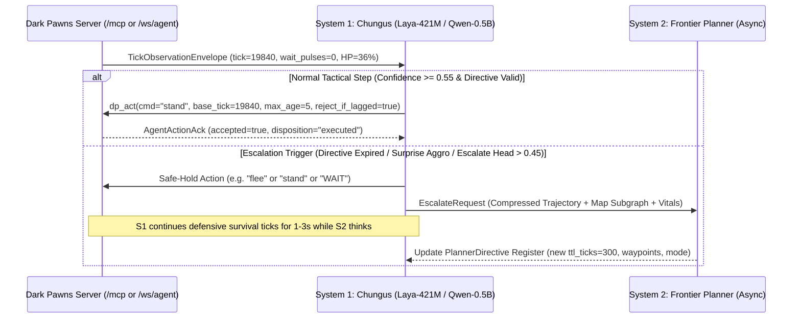

# Implementation Plan: System-1 Decision Model ("Chungus the Warrior") + Remote Agent Interface

> Date: 2026-10-06 · Scope: Post-port AI agent runtime, training pipeline, VPS inference, and streaming MCP/CLI wire protocol
> Continues: [`docs/plans/TRANSPORT-MCP-RESEARCH.md`](TRANSPORT-MCP-RESEARCH.md) (July 2026) and [`docs/plans/TRANSPORT-MCP-BACKLOG.md`](TRANSPORT-MCP-BACKLOG.md)
> Governing constraints: [`docs/fidelity/RULEBOOK.md`](../fidelity/RULEBOOK.md) (R1–R5) · [`docs/gmcp.md`](../gmcp.md) · [`DEPLOYMENT.md`](../../DEPLOYMENT.md)

---

## 0. Executive Summary & Settled Architecture Decisions

Dark Pawns enforces an iron rule: **an agent plays as a mortal player under the same rules, driving the ~500-command text parser with zero gameplay cheats and zero alterations to C-faithful player-facing output (R1, R2, R4).**

To play real-time Diku/CircleMUD combat (`PASSES_PER_SEC = 10` at `100 ms`, `PULSE_VIOLENCE = 20` at `2.0 s`) without paying frontier-LLM latency and token cost on every tick, the agent runtime is split into a **System 2 Frontier Planner** (asynchronous, low-frequency, `1.5–4.0 s` per call) and a **System 1 Tactical Decision Model** ("Chungus the Warrior", `~0.4B–0.5B` parameters, `< 150–450 ms` on CPU, `< 40 ms` on GPU).

| Layer / Component | Decision | Concrete Target / Library / Version | Rationale |
|---|---|---|---|
| **System 1 Primary Architecture (Non-Autoregressive)** | **Laya-421M** (`convaiinnovations/laya-typed-decisions`) | `ModernBERT-large` (395M) + 2-layer option-marker `[MASK]` scorer & `act/escalate` head (26M) = **421M params** (Apache-2.0); served via **ONNX Runtime `v1.20+` (`INT8`)** | Single forward pass (**0 decoded tokens**). Scores dynamically instantiated valid MUD commands (`Choice` primitive) + calibrated `act/escalate` probability in **85–135 ms** on 4 AVX2 vCPUs (**~530 MB RSS**). Surpasses TypeSafe `Jev` on `Typed-Decisions` (`0.766` vs `0.727`). |
| **System 1 Secondary Architecture (Causal Constrained DSL)** | **Qwen2.5-0.5B-Instruct** (`Q8_0` / `Q4_K_M`) | **494M params** ($L=24, H_{kv}=2, d_h=64$); served via **`ik_llama.cpp` / `llama-server` (`b5000+`)** compiled with **`-DLLAMA_LLGUIDANCE=ON`** | Only **12 MiB FP16 KV cache per 2,048-token slot** (**~510–645 MB RSS** for 4 concurrent agent slots; `Qwen3-0.6B` uses 18.7× more KV cache at 896 MiB). With `llguidance`, dynamic per-tick grammar compilation takes **`< 0.5 ms`** and decodes verb-first MUD commands (`bash 1.goblin`, 3–5 tokens) in **`305–450 ms`** on 3–4 vCPUs with `cache_prompt: true`. |
| **Action Interface to MUD Engine** | **Dynamic Candidate / CFG Compiler $\to$ Plain Text Command** | Per-tick admissible command generator + pre-flight transport guard (`SubmitAgentAction`) $\to$ `Session.handleCommand(cmd string)` | Eliminates the 15–40% parser rejection rate ("Huh?", "They aren't here.") of unconstrained 0.5B generation while guaranteeing that only standard text strings enter the MUD parser (R1/R2). |
| **State Observation Framing** | **512-Token Prefix-Stable Snapshot + 3-Turn Delta Ring** | Grounded solely on R4-clean GMCP / visible state + `IAC EOR` prompt boundaries | Eliminates stale-scrollback distractor nouns (Jericho `CALM` / `BALROG` finding) and preserves 60–85% KV-cache prefix reuse on causal decoders. |
| **Remote MCP Transport** | **`mark3labs/mcp-go` StreamableHTTP + Zero-RTT Tick Push** | `github.com/mark3labs/mcp-go v1.1.1` mounted at `/mcp` (`WithStateful(true)`, `BoundedMemoryEventStore(128)`, `WithDisableLocalhostProtection(true)`) | Pushes coalesced `TickObservationEnvelope` inline over `GET /mcp` SSE via `SendNotificationToSpecificClient` (`notifications/darkpawns/tick`, 0 extra HTTP RTTs) with `Last-Event-ID` mid-combat replay. |
| **Companion CLI Transport** | **WebSocket / NDJSON Duplex Stream** | `/ws/agent` via `github.com/gorilla/websocket v1.5.3` (already in `go.mod`) + `/agent/stream` NDJSON | Shares 100% of `TickObservationEnvelope`, `AgentActionRequest`, `AgentActionAck`, and 128-slot `replayRing` resumption (`reconnect_token` + `last_seq`) with `/mcp`. |
| **Training Pipeline** | **3-Stage: SFT (w/ Action Dropout) $\to$ Headless DAgger $\to$ GiGPO / Offline DPO** | `TRL` / `Unsloth` / `veRL` + Dark Pawns headless `DP_CLOCK=1` (`gameLoop.PumpPulses`) | `DP_CLOCK=1` steps Dark Pawns at **60,000–150,000 pulses/sec/core** (**3,000–7,500 combat rounds/sec**), making online DAgger recovery and GiGPO/REINFORCE++ RL practically free on CPU alongside a single training GPU. |

---

## 1. Action Representation & Constrained Decoding (`RQ1`)

### 1.1 Prior-Art Survey: System-1 Decision Models (as of October 2026)

1. **TypeSafe AI `Jev` (`POST https://api.typesafe.ai/v1/systemone`, `typesafe-sdk`)**:
   - Commercial closed-weights API (70–500 ms latency, `$0.042 / 1M` input tokens, `$0` output tokens).
   - Maps an input `state` + batch of `questions` in a **single non-autoregressive pass** to three typed primitives:
     - `Choice`: categorical distribution over a request-time option list + calibrated confidence.
     - `Score`: ordinal distribution + expected value over rubric levels (e.g., threat or urgency).
     - `Noul`: calibrated binary probability $P(\text{true}) \in [0, 1]$ for guard predicates.
2. **Convai Innovations `Laya` (`convaiinnovations/laya` & `convaiinnovations/laya-typed-decisions`, Apache-2.0)**:
   - Open-weights 421M parameter decision model (`NandhaKishorM/laya`, ONNX runtime port in `receptron/laya`).
   - **Backbone**: bidirectional `ModernBERT-large` encoder (395M params) + **2-layer Decision Head** (26M params).
   - **Mechanism**: Injects candidate options into the sequence prefixed by `[MASK]` option-marker tokens (`[STATE] ... [DIRECTIVE] ... [MASK] cmd_1 [MASK] cmd_2 ...`). Because attention is bidirectional, every `[MASK]` token attends to the full state and all sibling options simultaneously. A single forward pass extracts option logits + a dedicated **`Act/Escalate` head** trained with **RLCD** (Reinforcement Learning from Classifier Decisions using strictly proper Brier and log scoring rules + domain temperature scaling; `0.766` accuracy and `0.081` calibrated ECE on `Typed-Decisions`).
3. **Stanford & NVIDIA `CLM-8B` (`Contrastive-LM/CLM-v0.1-8B`, Apache-2.0)**:
   - Frozen `Qwen3-8B` backbone + two 20M-parameter projection heads (**State Head** $f_\theta(s)$ and **Action Head** $g_\phi(a)$) trained with bidirectional InfoNCE contrastive loss.
   - **Key pattern to borrow**: **Decoupled Action Embedding Caching**. Static and semi-static candidate actions are embedded once via $g_\phi(a)$; at each tick only $f_\theta(s_t)$ runs, and scoring 500+ actions is a matrix-vector dot product $f_\theta(s_t) \cdot A^T$ (`0.6 ms` on GPU). While `8B` is too heavy for a CPU VPS, a dual-encoder head can be distilled onto `ModernBERT-large` (395M) if candidate lists ever exceed `Laya`'s 512-token cross-encoder window.
4. **`s1decide` (`ziyacivan/s1decide`)**:
   - Single-pass Qwen + QLoRA decision head with KV-cache prefix pinning. Introduces **Negative Control Auditing**: training and evaluating on contradictory premises, missing targets, and impossible actions so the head reliably outputs high entropy / `escalate` instead of a confident hallucination.
5. **OpenAI `Decisions API` (Sept 2026 DevDay preview)**:
   - GPT-6 Luna checkpoint accepting context + finite option list in `~150 ms` (10.6× faster than autoregressive Luna), validating the industry convergence on **System 2 Planner + System 1 Bounded Option Selector**.

### 1.2 Tradeoff Analysis: Action Representations for a 0.5B Model over a ~500-Command Parser

Dark Pawns's command interpreter (`src/interpreter.c`, `pkg/session/`) registers ~500 entries, which decompose into:
- **~320 Canned Socials** (`nod`, `smile`, `cackle`, `bow <target>`): zero mechanical effect except room prose.
- **~165 Tactical, Movement, Item, & Informative Commands**:
  - 0-arg verbs: `north`, `east`, `south`, `west`, `up`, `down`, `flee`, `retreat`, `stand`, `rest`, `sleep`, `wake`, `parry`, `berserk`, `look`, `inventory`, `equipment`, `score`, `save`, `recall`.
  - 1-arg / 2-arg entity verbs: `kill <mob>`, `hit <mob>`, `kick <mob>`, `bash <mob>`, `rescue <ally>`, `bearhug <mob>`, `sleeper <mob>`, `headbutt <mob>`, `slug <mob>`, `smackheads <mob>`, `charge <mob>`, `track <target>`, `consider <mob>`, `diagnose <mob>`, `get <item> [container]`, `drop <item>`, `wear <item>`, `wield <item>`, `hold <item>`, `remove <item>`, `quaff <potion>`, `recite <scroll> [target]`, `eat <food>`, `drink <drinkcon>`, `open <door/container>`, `unlock <door/container>`, `buy <item>`, `sell <item>`, `list`, `practice [skill]`.
- **~12 Free-Text Communication Commands**: `say`, `gsay`, `tell`, `reply`, `whisper`, `ask`, `gossip`, `shout`, `holler`, `auction`, `emote`, `gtell`.

#### Warrior Skill Progression ("Chungus", `src/class.c:850-862`)
Chungus's tactical action space is strictly bounded by character level:
- **Lv 1**: `kick` (`SKILL_KICK`, wait: `PULSE_VIOLENCE * 2` or `+2`)
- **Lv 3**: `bash` (`SKILL_BASH`, wait: `PULSE_VIOLENCE * 2`, knocks target/self sitting)
- **Lv 4**: `rescue` (`SKILL_RESCUE`, wait: `PULSE_VIOLENCE * 2`)
- **Lv 5**: `retreat` (`SKILL_RETREAT`, `pkg/session/combat_cmds.go:337`, wait: `PULSE_VIOLENCE + 2` on fail)
- **Lv 7**: `bearhug` (`SKILL_BEARHUG`)
- **Lv 8**: `berserk` (`SKILL_BERSERK`)
- **Lv 12**: `sleeper` (`SKILL_SLEEPER`)
- **Lv 13**: `parry` (`SKILL_PARRY`, `pkg/session/combat_cmds.go:181`, wait: `2 * PULSE_VIOLENCE` success / `3 * PULSE_VIOLENCE` fail)
- **Lv 15**: `headbutt` (`SKILL_HEADBUTT`)
- **Lv 17**: `slug` (`SKILL_SLUG`)
- **Lv 20**: `smackheads` (`SKILL_SMACKHEADS`)
- **Lv 23**: `charge` (`SKILL_CHARGE`)

#### Comparing the Three Candidate Paradigms

| Criterion | Option 1: Raw Unconstrained String Generation | Option 2: Single-Pass Typed Decision Scorer (`Laya-421M` ONNX) | Option 3: Causal SLM + Dynamic Verb-First `llguidance` CFG (`Qwen2.5-0.5B`) |
|---|---|---|---|
| **Syntactic & Target Validity** | **60–85%** on 0.5B (hallucinates non-existent exits, guesses wrong mob keyword from long desc, uses skills not yet learned). | **100%** (only scores candidate commands instantiated from visible exits, room `target_string`s, inventory, and learned skills). | **100%** (per-tick grammar restricts verbs to learned skills and nouns to visible `target_string`s). |
| **Tokens Decoded per Turn** | 2–8 tokens | **0 tokens** (single encoder pass over `[MASK]` markers) | **2–6 tokens** (verb-first MUD DSL) vs **14–20 tokens** if emitting JSON |
| **VPS CPU Latency (3–4 vCPUs)** | ~150–250 ms | **~85–135 ms** (`INT8` ONNX) | **~180–280 ms** (3–5 token DSL) / **~450–650 ms** (18-token JSON) |
| **Calibrated Uncertainty / Escalate** | Poor (uncalibrated token logprobs) | **Native** (`Act/Escalate` head + RLCD Brier calibration) | Requires computing entropy over first-token verb distribution |
| **Scale to Large Room/Inventory** | Context-independent decode | Bounded by 512-token window (~15–25 pruned candidate options per pass) | Handles 50+ targets in grammar with `< 0.5 ms` `llguidance` compile |

#### Why Constrained JSON Losses to Both `Laya-421M` Option Scoring and Verb-First Command Grammars
On a 0.5B causal model, forcing JSON output (`{"intent":"ATTACK","skill":"bash","target":"1.goblin"}`) has two proven penalties:
1. **Token Inflation**: 15–20 tokens of JSON syntax vs. 3–4 tokens for `"bash 1.goblin\n"`, multiplying CPU decode time by **3.5×** (`~280 ms` extra on 3 vCPUs).
2. **Format-Restriction Accuracy Loss** (Tam et al., 2024, arXiv:2408.02442): Forcing structural JSON keys before the semantic decision distorts small-model logit trajectories unless trained with a preceding scratchpad field.

#### Settled Action Architecture for Chungus (Dual-Support in Runner)

We implement a deterministic **Admissible Action Compiler (`pkg/agent/action_space.go`)** in the agent runner that inspects the current `TickObservationEnvelope` and outputs both:

1. **For `Laya-421M` (Primary System 1)**: A pruned list of **8–24 concrete candidate command strings** (`Choice` options) + 2 meta-actions:
   - `WAIT` (no-op: let ongoing melee auto-attack round proceed without queueing lag)
   - `ESCALATE_PLANNER` (trigger System 2 re-plan / social response; also triggered automatically if `Laya`'s `act/escalate` head exceeds threshold $\tau_{\text{esc}}$)
   - Concrete instantiated commands for the current state, e.g.:
     - If `Position == Sitting`: `["stand", "flee", "quaff 1.yellow", "ESCALATE_PLANNER"]` (prunes impossible standing-only skills!).
     - If `Position == Fighting`: `["WAIT", "bash 1.goblin", "kick 1.goblin", "parry", "flee", "retreat", "quaff 1.yellow", "ESCALATE_PLANNER"]`.
     - If `Position == Standing` (non-combat): valid exits (`"north"`, `"east"`), target openers (`"kill 1.goblin"`, `"consider 1.goblin"`), item actions (`"get all 1.corpse"`, `"quaff 1.yellow"`, `"eat 1.bread"`, `"rest"`).
2. **For `Qwen2.5-0.5B` + `llguidance` (Secondary / Generative Fallback)**: A compact, dynamically generated per-tick GBNF/`llguidance` grammar (~15–25 rules, `< 0.3 ms` compile time) over the exact same admissible set:
   ```gbnf
   root        ::= "WAIT" | "ESCALATE" | move_cmd | combat_cmd | item_cmd | state_cmd | social_cmd
   move_cmd    ::= "north" | "east" | "south"
   combat_cmd  ::= ("kill " | "bash " | "kick ") mob_target | "parry" | "flee" | "retreat"
   mob_target  ::= "1.goblin" | "2.goblin" | "shaman"
   item_cmd    ::= "quaff " potion_kw | "get all " corpse_kw | "eat " food_kw
   potion_kw   ::= "1.yellow"
   corpse_kw   ::= "1.corpse"
   food_kw     ::= "1.bread"
   state_cmd   ::= "stand" | "rest" | "sleep" | "wake" | "look"
   social_cmd  ::= ("say " | "gsay ") [a-zA-Z0-9 ,.!?' -]{1,80}
   ```

#### Handling Free-Text Commands (`say`, `tell`, `gsay`, `emote`)
A 0.5B tactical model should not improvise open-ended roleplay or multi-sentence chat mid-combat:
- **Inbound speech from another player/NPC** (`Comm.Channel.Text` event in `TickObservationEnvelope`) sets an `incoming_comm` flag in the observation.
- System 1 continues executing immediate survival/combat commands (`stand`, `flee`, `bash`) while simultaneously routing the speech event to the **System 2 Planner**.
- When System 2 wants Chungus to speak, it populates `queued_utterance` in the `PlannerDirective` (e.g., `"say Hail, traveler. Wait until this goblin falls."`), which the runner emits at the next `wait_pulses == 0` non-crisis tick, or allows `Laya-421M` to select `[MASK] say Hail, traveler...` as a discrete candidate option.

---

## 2. State Representation, Observation Window & Fixing R4 Leaks (`RQ2`)

### 2.1 Codebase Audit: Four Rulebook R4 Violations in `pkg/session/agent_vars.go` That Must Be Fixed First

A direct comparison between [`pkg/session/agent_vars.go`](../../pkg/session/agent_vars.go) (the legacy `/ws` agent variable system) and [`docs/gmcp.md`](../gmcp.md) (the C-faithful GMCP implementation) reveals **four agent-cheat / correctness bugs** in `agent_vars.go`:

1. **Exact Enemy Integer HP Leak (`pkg/session/agent_vars.go:206-216`)**:
   - `VarFighting` currently emits `"hp": target.GetHP(), "max_hp": target.GetMaxHP()`.
   - **Violation**: In CircleMUD/Dark Pawns, a mortal player never sees a mob's integer HP or MaxHP—only the 8 qualitative condition bands printed by `diag` / prompts (`excellent condition`, `few scratches`, `small wounds`, `quite a few wounds`, `big nasty wounds`, `pretty hurt`, `awful condition`, `bleeding awfully from big wounds`).
   - **Fix**: Replace `hp`/`max_hp` on enemy targets with `condition_band` (string) and `health_bucket` (coarse enum midpoint `1.00, 0.90, 0.75, 0.50, 0.30, 0.15, 0.05, 0.00` matching C's exact `diag` thresholds).
2. **Blindness / Darkness / Invisibility Leak (`pkg/session/agent_vars.go:190-205, 268-332`)**:
   - `VarRoomName`, `VarRoomExits`, `buildRoomMobs()`, and `buildRoomItems()` query `s.manager.world.GetRoom(...)`, `GetMobsInRoom(...)`, and `GetItemsInRoom(...)` directly without checking whether the room is dark, the player is `AFF_BLIND`, or the mob/item is invisible (`CAN_SEE` / `CAN_SEE_OBJ`).
   - **Fix**: Apply the exact visibility gates documented in `docs/gmcp.md:17-25`: if `AFF_BLIND` or dark room without light, suppress `room_name`, `room_exits`, `room_mobs`, and `room_items` (`can_see_room: false`). Filter every mob via `world.CanSeeChar(s.player, mob)` and every item via `world.CanSeeObj(s.player, item)`.
3. **Closed-Door Autoexit Leak & VNum Leak (`pkg/session/agent_vars.go:196-201, 294, 328`)**:
   - `getExitNames(room.Exits)` returns closed doors that mortal `do_auto_exits` and GMCP `Room.Info` omit (`docs/gmcp.md:21`). And `RoomMobVar.VNum` / `RoomItemVar.VNum` expose internal mob/object prototype VNums (whereas `Room.Info.num` is public on the website map, mob/item VNums are not).
   - **Fix**: Reuse GMCP's `do_auto_exits` exit filter for `room_exits`, and omit mob/object prototype `VNum`s from mortal agent payloads (or hash them into opaque session-local IDs).
4. **Slice-Index Shift Bug in `RoomMobVar.InstanceID` (`pkg/session/agent_vars.go:292`)**:
   - Currently `InstanceID: fmt.Sprintf("mob_%d_%d", mob.VNum, i)` uses `i`, the loop index in `GetMobsInRoom()`. When `mobs[0]` dies and is extracted from the room, `mobs[1]` shifts to `i = 0` and its `InstanceID` silently mutates from `mob_3001_1` to `mob_3001_0`!
   - **Fix**: Add a monotonically increasing `RuntimeID uint64` (`atomic.Uint64` in `pkg/game`) assigned when each `Mobile` and `Object` instance is created, and format `InstanceID` as `fmt.Sprintf("mob_%d", mob.RuntimeID)`.

### 2.2 Observation Window Size & Structure (512-Token Compact Block)

Literature across Jericho (`DRRN`, `CALM` Yao et al., 2020), NetHack (`ChaoticDwarf`, `AutoAscend`), and `BALROG` (Paglieri et al., 2024, arXiv:2411.13543) establishes two hard rules for `<1B` game models:
- **Never feed >3 turns of raw terminal scrollback**: In `CALM`, feeding >2 turns of raw transcript to a small LM degraded action accuracy because nouns from previously visited rooms ("cityguard", "fountain") remained in attention and caused invalid `kill`/`get` commands.
- **Pre-compute vital ratios and severity tags**: 0.5B models fail at mental division (`42/110` vs `42/45`). Explicitly rendering `HP: 42/110 (38% - LOW)` gives a lexical token anchor for `flee`/`quaff`.

#### Exact Prompt / Observation Layout (~220–310 Tokens Total)

For `Qwen2.5-0.5B` (`llama-server`), blocks 1–3 are placed at the **top** (static/semi-static prefix cached via `id_slot` + `cache_prompt: true`), while blocks 4–7 are at the **bottom** (dynamic per-tick suffix). For `Laya-421M`, the entire block (~280 tokens) + `[MASK]` candidate options (~80 tokens) fits inside the **512-token** `ModernBERT-large` window with >150 tokens to spare:

```text
[ROLE] Dark Pawns Warrior | Name: Chungus | Lv: 7 | Skills: kick, bash, rescue, retreat, bearhug
[DIRECTIVE] mode=COMBAT_GRIND | zone="The Sewers" | target_allow=[rat, spider] | flee_hp=25% | goal="Clear room 3054 then move east to 3055"
[LOADOUT] wield="a tarnished longsword" | body="scale mail" | light="a brass lantern" | inv=[1.yellow(potion)x2, 1.recall(scroll)x1, 1.bread(food)x2] | gold=310
[STATUS] HP: 42/115 (36% - LOW) | MV: 84/100 (84%) | Pos: Sitting [MUST STAND TO MOVE/FLEE/BASH] | Lag: 0 pulses | Wimpy: 20 | Affects: [poison, armor]
[ROOM] [3054] The Muddy Sewer Junction (Indoors) | Exits: [north:3053, east:3055, up:3005]
Mobs:
- 1.rat ("a fierce sewer rat") [id:mob_8841, fighting:YOU, cond:awful (~15%)]
- 1.spider ("a giant cave spider") [id:mob_8842, fighting:NONE, cond:excellent (100%)]
Items: [1.corpse ("the corpse of a sewer rat")]
[NAV_MEMORY] trail=[3005->d->3053(v:1), 3053->s->3054(v:1)] | unvisited_exits=[east]
[RECENT_DELTAS]
t-2: cmd="kill 1.rat" -> You slash a fierce sewer rat hard.
t-1: cmd="bash 1.rat" -> You miss your bash and fall! [Pos->Sitting] | 1.rat bites YOU (2 hits, -18 HP).
t-0: tick -> You shiver and suffer from poison! (-6 HP).
[CANDIDATES] [MASK] stand [MASK] quaff 1.yellow [MASK] WAIT [MASK] ESCALATE_PLANNER
```

#### Compression Rules Applied by the Runner's State Formatter
1. **Room Prose Stripping**: Strip the 60–150 token atmospheric room description unless the `PlannerDirective` sets `inspect_room_prose: true` (e.g., for reading a quest sign or puzzle room). Retain `[VNUM] Title (Terrain) | Exits`.
2. **Multi-Swing Combat Compression**: If 6 mobs attack Chungus in one `PULSE_VIOLENCE` round (producing 12–18 lines of miss/parry/hit text), the formatter collapses them into one summary line per round: `1.goblin x3, 2.goblin x2 hit YOU (5 hits, 4 misses, -34 HP total)`.
3. **Explicit Position Constraint Tag**: Whenever `Position != Standing && Position != Fighting` during combat (e.g., `Sitting` after a failed `bash` or enemy bash), append `[MUST STAND TO MOVE/FLEE/BASH]` directly to `Pos:`.

---

## 3. Planner / Decision Split & Latency Budgets (`RQ3`)

### 3.1 Dark Pawns Timing Realities (`src/structs.h`, `pkg/engine/gameloop.go`)

| Engine Constant | Value | Real-Time Duration | Gameplay Impact on Agent |
|---|---|---|---|
| `OPT_USEC` / `PASSES_PER_SEC` | `100,000 µs` / `10 Hz` | **`100 ms`** | Fundamental pulse unit. `OnDrainInput` decrements `WaitState` by 1 pulse and pops at most 1 queued command when `WaitState <= 0` (`pkg/session/manager.go:1074-1079`). |
| `PULSE_VIOLENCE` | `20 pulses` | **`2,000 ms (2.0 s)`** | Automatic melee combat round (`PerformRound()`). Every fighting actor swings 1–4 times based on dual-wield / haste / warrior multi-attack. |
| `WAIT_STATE` (`hit`, `retreat` fail) | `PULSE_VIOLENCE + 2` (`22 pulses`) | **`2,200 ms (2.2 s)`** | Player is lagged for 22 pulses (`pkg/session/combat_cmds.go:131, 362`). Commands sent during this window sit in `s.inputQueue`. |
| `WAIT_STATE` (`bash`, `kick`, `parry`) | `2 * PULSE_VIOLENCE` (`40 pulses`) or `3 * PULSE_VIOLENCE` (`60 pulses`) | **`4.0 s` – `6.0 s`** | Heavy skill lag (`pkg/session/combat_cmds.go:217, 227`). |
| `PULSE_MOBILE` | `40 pulses` | **`4,000 ms (4.0 s)`** | Mob wandering, scavenger pickup, aggressive mob initiation (`MobileActivity`), environmental room damage (`RoomActivity`), and `OS_ONPULSE` Lua scripts (`ObjectActivity`). |
| `PULSE_ZONE` | `100 pulses` | **`10,000 ms (10.0 s)`** | Zone age increment and zone reset checks (`ZoneUpdate`). |
| `SECS_PER_MUD_HOUR` | `630 pulses` | **`63,000 ms (63.0 s)`** | `WeatherAndTime`, `AffectUpdate` (spell/poison tick-down), and `PointUpdate` (HP/Mana/Move regeneration). |

### 3.2 End-to-End Latency Budget

Because `PULSE_VIOLENCE` is `2,000 ms` and `OnDrainInput` runs every `100 ms`:
- **Target End-to-End Decision Loop (Tick Flush $\to$ Wire $\to$ System 1 Inference $\to$ Wire $\to$ `SubmitAgentAction`)**: **`< 500 ms` p95** (5 pulses; ideally **`150–300 ms`**).
  - **Server Coalesce & SSE/WS Push**: `< 2 ms`
  - **Network RTT (Remote Agent $\leftrightarrow$ VPS)**: `20–80 ms` (or `< 1 ms` if System 1 runs locally on the VPS and only System 2 is remote!)
  - **System 1 Inference (`Laya-421M` ONNX `INT8` or `Qwen2.5-0.5B` `llguidance`)**: `90–350 ms` on CPU (or `15–35 ms` on remote GPU/Apple Silicon)
  - **Pre-Flight Guard & Command Enqueue**: `< 1 ms`
- **Actionable Pulse Triggering**: Because the server includes `"wait_pulses": N` in every `TickObservationEnvelope` and emits a tick notification when `wait_pulses` reaches `0` (or when a combat round fires while `wait_pulses == 0`), **System 1 only runs inference when `wait_pulses == 0` (or `<= 2` to pre-stage an action for the exact pulse lag expires)**. This cuts System 1 inference invocations during `bash`/`parry` combat by **60–75%**.

### 3.3 Interface Between System 2 (Frontier Planner) and System 1 ("Chungus" 0.5B)



#### The `PlannerDirective` Schema (System 2 $\to$ System 1 Register)

System 2 never issues raw movement steps (`north`, `north`, `east`) directly to the wire; it writes a versioned `PlannerDirective` struct into shared runner state:

```json
{
  "directive_id": "plan-0042",
  "issued_at_tick": 19800,
  "ttl_ticks": 300,
  "mode": "COMBAT_GRIND",
  "goal_summary": "Kill sewer rats in 3054-3058; do not attack giant spiders yet.",
  "expected_zone": "The Sewers",
  "waypoints": [3054, 3055, 3058],
  "target_allow": ["rat", "bat"],
  "target_forbid": ["spider", "cityguard", "janitor", "guildmaster", "shopkeeper"],
  "use_skills": ["bash", "kick"],
  "flee_hp_pct": 0.28,
  "rest_hp_pct": 0.65,
  "quaff_hp_pct": 0.22,
  "inspect_room_prose": false,
  "queued_utterance": ""
}
```

#### Cadence & Stale-Plan Escalation Conditions
System 2 is invoked **asynchronously** (never blocking System 1's 100ms/2.0s combat loop) under 6 explicit conditions:
1. **Subgoal Completed**: Target room vnum reached (`NAVIGATE_PATH`), target mob killed and looted, or HP/MV recovered to `>= 95%` (`RECOVER_VITALS`).
2. **TTL Expiry**: `current_tick - issued_at_tick >= ttl_ticks` (default 300 ticks = 30 seconds).
3. **Topological Deviation**: `flee`, `retreat`, or a teleport trap puts Chungus in a room not on `waypoints` and outside the 2-hop BFS neighborhood of the planned path.
4. **Unexpected Aggro / Crisis**: Entering combat with a mob not in `target_allow`, `HP / MaxHP <= flee_hp_pct`, or acquiring a dangerous debuff (`blind`, `poison`, `curse`).
5. **Model Uncertainty / Negative Control (`Act/Escalate` Gate)**: `Laya-421M`'s `escalate` head probability exceeds `0.45` (or top-1 `Choice` probability `< 0.55`), or 2 consecutive commands result in parser/world refusal (`"Alas, you cannot go that way..."`, `"They aren't here."`).
6. **Social Event**: Inbound `say`, `tell`, or `gsay` directed at Chungus.

#### Safe-Hold Fallback Policy While a Plan Is Stale (During the 1.5–4.0s System 2 Re-Plan Window)
While `s2_replan_in_flight == true`, System 1 switches its active directive to a deterministic **`SAFE_HOLD`** directive:
- **If in combat (`Fighting == true`)**:
  - If `Position == Sitting`: emit `stand`.
  - If `HP / MaxHP <= flee_hp_pct`: emit `flee` (or `quaff <healing_potion>` if cornered).
  - Otherwise: continue standard melee (`parry` / `bash` / `WAIT`) against the current attacker.
- **If not in combat (`Fighting == false`)**:
  - Emit `WAIT` (stay in current room; if `HP / MaxHP < 0.50` and no aggressive mobs are in `room_mobs`, `rest`). Never wander into unexplored rooms while waiting for a new plan.

---

## 4. Training Recipe: From Mudlet + Sidecar Logs to "Chungus the Warrior" (`RQ4`)

### 4.1 Log Ingestion & `WAIT_STATE` De-Aliasing Pipeline

#### Note on Telemetry Storage (SQLite vs. Postgres Sidecar)
Per [`DEPLOYMENT.md`](../../DEPLOYMENT.md), the Dark Pawns server itself now uses embedded SQLite (`lib/data/darkpawns.db`), while historical agent runs used a Postgres sidecar. The training ingestion CLI (`tools/dp-ingest-logs/`) will accept three input sources and normalize them into a single Parquet/JSONL dataset (`data/training/chungus_trajectories.jsonl`):
1. **Mudlet Human Logs** (`.txt`/`.html` raw logs + a 25-line Mudlet Lua package script `mudlet/chungus_recorder.lua` that hooks `onPrompt` / `IAC EOR` and `gmcp.Char.Vitals`, `gmcp.Room.Info` to write structured JSONL turns directly to disk during the owner's Lv 1–30 playthrough).
2. **Historical Postgres Sidecar Captures** (`SELECT session_id, ts, command, room_vnum, hp, max_hp ...`).
3. **New Agent Telemetry SQLite/JSONL Sidecar** (`data/sessions/{agent_id}/{YYYY-MM-DD}.jsonl` matching [`docs/research/evaluation-methodology.md`](../research/evaluation-methodology.md)).

#### Solving Asynchronous Tick & Type-Ahead Misalignment (`WAIT_STATE` De-Aliasing)
When a human warrior types `bash` at $t = 0.0\text{s}$ (imposing 40 pulses = `4.0 s` of `WAIT_STATE`) and types `flee` at $t = 1.2\text{s}$, the client log records `flee` *before* the $t = 2.0\text{s}$ combat round, even though Dark Pawns's `DrainInputQueues` (`pkg/session/manager.go:1055-1101`) does not dequeue `flee` until $t = 4.0\text{s}$!
- **De-Aliasing Rule**:
  1. Segment the raw stream on **`IAC EOR`** (or Dark Pawns's exact `make_prompt` regex from `pkg/session/session_send.go:400-447`, preserving the ANSI health color codes `\x1b[32m`/`33m`/`31m`).
  2. Distinguish synchronous command-response prompts from asynchronous heartbeat-tick prompts (`FlushAsyncPrompts` in `pkg/session/manager.go:756` prepends `\r\n` via `TrackPrompt` in `pkg/session/terminal.go:155-169`).
  3. **Shift Type-Ahead Commands to Their Execution Boundary**: Pair each human command $a_k$ with the observation state $o_k$ immediately preceding the server's execution of $a_k$ (folding all intermediate `PULSE_VIOLENCE` rounds during `WAIT_STATE` into $o_k$'s `[RECENT_DELTAS]`).
  4. **Collapse Panic-Mashing & Cosmetics**: If a human types `flee; flee; flee` during lag and the first executed `flee` succeeds (leaving the trailing two to print `"You aren't fighting anyone!"`), strip the trailing duplicates. Downsample passive combat rounds (`action == "WAIT"`) at **5:1** so `WAIT` does not dominate 70% of combat steps.

#### Hindsight `PlannerDirective` Relabeling (SwiftSage / HER)
Because human Mudlet logs do not contain explicit System 2 prompts:
1. Segment each recorded session into macro-episodes at zone transitions, combat start/end, death/corpse-run, and shop/practice/rest boundaries.
2. Back-annotate each segment with the corresponding `PlannerDirective` (`COMBAT_GRIND`, `NAVIGATE_PATH`, `RECOVER_VITALS`, `SHOP_RESTOCK`, `CORPSE_RUN`), populating `waypoints` from the actual room sequence traversed and `target_allow` from the mobs engaged.
3. **Counterfactual Safety Augmentation (20% of combat steps)**: Duplicate combat observations where `0.20 <= HP/MaxHP <= 0.45` and overwrite `PlannerDirective.flee_hp_pct = (HP/MaxHP) + 0.05` with ground-truth label `action = "flee"` (or `"retreat"`). This forces the 0.5B model to attend to `flee_hp_pct` in the directive rather than memorizing a fixed HP threshold.

### 4.2 Behavioral Cloning Failure Modes in MUDs & Concrete Mitigations

| BC Failure Mode | MUD Failure Scenario | Concrete Mitigation in Training Recipe |
|---|---|---|
| **Covariate Shift ($O(T^2 \epsilon)$, Ross et al. 2011)** | Chungus takes 1 wrong exit or flees into an unvisited sewer room and wanders randomly until killed. | **Headless `DP_CLOCK` DAgger**: Inject 10% random exit/flee perturbations in headless simulation; use a shortest-path BFS solver over `/darkpawns-map.xml` (`pkg/mudletmap`) + scripted combat heuristics to label 25k recovery steps. |
| **Causal Confusion (de Haan et al. 2019; Ortega et al. 2021)** | Human types `bash` every 2 rounds; model learns $P(a_t = \text{bash} \mid a_{t-2} = \text{bash}) \approx 1$ and outputs `bash` while `Sitting` or after the mob dies. | **40% Action-History Dropout during SFT**: Randomly mask the `cmd="..."` strings in `[RECENT_DELTAS]` during training so the model must read current `[STATUS]` (`Pos: Sitting`) and `[ROOM]` (`Mobs:`). |
| **History Aliasing (Stale Scrollback)** | Model attacks `"cityguard"` seen 3 rooms ago in raw scrollback. | **512-Token Snapshot Framing**: Never include prior rooms' mob/item lists; only the current room's visible entities exist in `[ROOM]`. |
| **Mode Averaging** | Two goblins (`1.goblin`, `2.goblin`) or two valid exits (`north`, `east`) split probability mass or cause target flip-flopping every round. | **Deterministic Target Ordering & Directive Conditioning**: Always sort `Mobs:` with `fighting:YOU` first (`[TARGET]`), and condition navigation on `PlannerDirective.waypoints`. |
| **Navigation Looping ("Echo Trap", RAGEN 2025)** | Agent oscillates `north` $\leftrightarrow$ `south` between two empty rooms indefinitely. | **`[NAV_MEMORY]` Visitation Ring + Reverse-Exit Penalty**: Surface visit counts per room in `[NAV_MEMORY]` and apply a `-2.0` logit bias to the reverse of the last movement direction unless `Fighting == true` or at a dead end. |
| **Overconfident Hallucination on Invalid State (`s1decide`)** | Planner directive says `"kill 1.dragon"` in a room with no dragon, or door is locked. | **10% Negative-Control Synthetics (`s1decide` pattern)**: Inject synthetic training rows with missing targets, locked doors, or `Pos: Sitting` where the ground-truth label is `ESCALATE_PLANNER` or `stand`. |

### 4.3 Data Volume Estimate for a ~0.4B–0.5B Model

- **Human Output Rate**: Active Mudlet play yields **15–30 commands/min** (`~1,350 commands/hr`) + `~750 passive combat ticks/hr` $\to$ **~1,000 deduplicated, high-signal training tuples per hour** after 5:1 `WAIT` downsampling.
- **Volume Required**:
  - **Phase A (Lv 1–10 Prototype, 3–4 Zones)**: **8–12 hours** of human Mudlet logging (**~8,000–12,000 tuples**) + **5,000** synthetic negative-control / DAgger recovery tuples. (Matches FireAct / SwiftSage sample efficiency for a bounded candidate set).
  - **Phase B (Lv 1–30 Full "Chungus the Warrior")**: **35–50 hours** of human play (1 full Lv 1–30 progression run + targeted zone/boss/corpse-run logs = **~35,000–50,000 human tuples**) + **30,000** headless `DP_CLOCK` DAgger + Postgres/SQLite agent-play tuples = **~75,000 total tuples**.

### 4.4 SFT vs. Offline RL vs. Headless Online RL (`DP_CLOCK=1`)

#### Why Dark Pawns Is Uniquely Suited for High-Speed Headless RL
Dark Pawns already has a deterministic, wall-clock-free execution mode built for `cmd/dp-oracle-diff`:
- Setting `DP_CLOCK=1`, `DP_SEED=<seed>`, `DP_FIXED_TIME=1770838461`, and `DP_ALLOW_NO_DB=1` freezes the 100ms real-time ticker and runs `initializeWorld()` synchronously (`cmd/server/main.go:238, 586, 797`).
- Calling `gameLoop.PumpPulses(20)` (`pkg/engine/gameloop.go:198-215`) advances the entire world by 1 full combat round (`2.0 s` of game time) in **~15–250 µs** on 1 CPU core.
- **Headless Throughput**: A single Go process driving `PumpPulses` in-memory steps at **60,000–150,000 pulses/sec/core** (**3,000–7,500 combat rounds/sec**, or **~10,000× real-time**) using only **~40 MB RAM per world instance**.

#### Three-Stage Training Progression
1. **Stage 1 — Supervised Fine-Tuning (SFT / RLCD)**:
   - **For `Laya-421M`**: Fine-tune `convaiinnovations/laya-typed-decisions` with RLCD (cross-entropy + Brier proper scoring loss on `[MASK]` option logits + binary cross-entropy on the `act/escalate` head) for 3 epochs (`lr = 2e-5`, batch size 64, ~45 minutes on 1× RTX 4090 / A100). Fit post-hoc temperature scaling parameter $T$ on the validation split (`ECE < 0.05`).
   - **For `Qwen2.5-0.5B-Instruct`**: Full-weight SFT (or LoRA $r=32, \alpha=64$ merged to FP16 then quantized to `Q8_0` GGUF) on the exact prompt + verb-first command output format with 40% action-history dropout (`TRL` `SFTTrainer` / `Unsloth`, ~30 minutes on 1× GPU).
2. **Stage 2 — Headless DAgger + Step-Level DPO / KTO (Offline RL)**:
   - Run the Stage-1 checkpoint through 1,000 seeded headless episodes in `DP_CLOCK=1` mode.
   - Harvest states where Chungus died, looped, or triggered parser errors. Relabel optimal recovery actions via BFS map oracle (`pkg/mudletmap`) + combat safety rules (or frontier LLM teacher), and construct preference pairs `(state, a_survive, a_died)` for **Step-Level DPO / KTO**.
3. **Stage 3 — Online GiGPO / REINFORCE++ over Parallel `DP_CLOCK` Workers (Optional Polish)**:
   - Spawn 32 parallel Go `DP_CLOCK=1` workers (~1.3 GB total RAM) stepped via **GiGPO** (Group-in-Group Policy Optimization, Feng et al., 2025, arXiv:2505.10978) using step reward:
     $$r_t = 1.0 \cdot \frac{\Delta \text{XP}_t}{\text{XP}_{\text{level}}} + 0.2 \cdot \Delta\!\left(\frac{\text{HP}_t}{\text{MaxHP}_t}\right) - 5.0 \cdot \mathbb{I}[\text{died}_t] - 0.1 \cdot \mathbb{I}[\text{parser\_err}_t] - 0.005$$

---

## 5. VPS Inference Stack, Resource Budget & Co-Tenancy (`RQ5`)

### 5.1 Memory & CPU Benchmarks (360M–600M Class on 2–4 vCPUs)

Exact KV-cache formula for `llama.cpp`:
$$\text{KV}_{\text{bytes}} = 2 \times n_{\text{layers}} \times n_{\text{kv\_heads}} \times d_{\text{head}} \times N_{\text{ctx\_per\_slot}} \times n_{\text{slots}} \times \text{bytes\_per\_elem}$$

| Model & Serving Runtime | Quantization | Weight Size | KV Cache (4 Slots @ 2048 ctx) | Total Daemon RSS (4 Slots) | 4 vCPU (AVX2) Latency per Decision | 4 vCPU (AVX-512 / Zen 4) Latency per Decision |
|---|---|---|---|---|---|---|
| **`Laya-421M`** (`ONNX Runtime v1.20+`) | `INT8` (dynamic) | 425 MB | **0 MB** (Encoder, no KV cache) | **~530 MB** | **85–135 ms** (full 380-tok pass, 0 decode steps) | **55–90 ms** |
| **`Qwen2.5-0.5B-Instruct`** (`ik_llama.cpp` / `llama-server` + `llguidance`) | `Q8_0`<br>`Q4_K_M` | 531 MB<br>398 MB | **48.0 MiB** (FP16)<br>**25.5 MiB** (`q8_0`) | **~645 MB**<br>**~510 MB** | **190–280 ms** (100-tok delta prefill + 4-tok DSL decode) | **125–190 ms** |
| **`SmolLM2-360M-Instruct`** (`llama-server` + `llguidance`) | `Q8_0`<br>`Q4_K_M` | 386 MB<br>258 MB | 160.0 MiB (FP16)<br>85.0 MiB (`q8_0`) | **~610 MB**<br>**~480 MB** | **150–230 ms** (100-tok delta prefill + 4-tok DSL decode) | **100–155 ms** |
| **`Qwen3-0.6B`** *(Not Recommended)* | `Q4_K_M` | 397 MB | **896.0 MiB** (FP16) | **~1,360 MB** | 260–390 ms (`<think>` stripped) | 170–260 ms |

### 5.2 Single-VPS Serving Stack & `systemd` Co-Tenancy Isolation

On a single Debian VPS (e.g., 4 vCPUs, 4–8 GB RAM), the primary operational risk is **CPU starvation of the Go MUD server**: OpenMP/pthread matrix-multiply threads in `onnxruntime` or `llama-server` spin at 100% CPU utilization during inference bursts, which can delay Go's `100 ms` `GameLoop` ticker if unpinned.

```
┌─────────────────────────────────────────────────────────────────────────┐
│ Debian VPS (4 vCPUs, 4–8 GB RAM)                                        │
│                                                                         │
│  ┌───────────────────────────────────┐  ┌─────────────────────────────┐ │
│  │ vCPU 0 (CPUAffinity=0, Nice=-5)   │  │ vCPUs 1,2,3 (CPUAffinity=   │ │
│  │                                   │  │ 1 2 3, Nice=10, MemMax=1G)  │ │
│  │  • darkpawns-server (Go binary)   │  │                             │ │
│  │    - <5% CPU, ~120 MB RSS         │  │  • chungus-s1-daemon        │ │
│  │    - :4350 (/mcp, /ws/agent)      │  │    - Option A: ONNX Runtime │ │
│  │    - :7777 (telnet)               │  │      Laya-421M INT8 (~530M) │ │
│  │    - SQLite (lib/data/darkpawns)  │  │    - Option B: llama-server │ │
│  │  • caddy (TLS reverse proxy)      │  │      Qwen2.5-0.5B Q8_0      │ │
│  │  • chungus-runner (Go/Python)     │  │    - Unix socket:           │ │
│  │    - Reflex gate + S1/S2 router   │  │      /run/chungus/s1.sock   │ │
│  └─────────────────┬─────────────────┘  └──────────────▲──────────────┘ │
│                    │  Local loopback / Unix socket     │                │
│                    └───────────────────────────────────┘                │
└────────────────────────────────────┬────────────────────────────────────┘
                                     │ HTTPS (Outbound to Frontier API
                                     ▼  or Inbound Remote MCP Client)
                        [ System 2 Frontier Planner ]
```

#### Concrete `systemd` Unit (`deploy/systemd/chungus-s1.service`)
```ini
[Unit]
Description=Dark Pawns System-1 Decision Model Service (Laya-421M / Qwen2.5-0.5B)
After=network.target

[Service]
Type=simple
User=darkpawns
Group=darkpawns
# Reserve vCPU 0 exclusively for darkpawns-server and Caddy
CPUAffinity=1 2 3
Nice=10
CPUSchedulingPolicy=batch
MemoryMax=1024M
MemorySwapMax=0

# Option A (Laya-421M ONNX INT8 via FastAPI/Uvicorn or Go onnxruntime_go):
ExecStart=/opt/darkpawns/venv/bin/python -m chungus_s1.serve \
  --model /opt/darkpawns/models/laya-chungus-v1-int8.onnx \
  --intra-op-threads 3 --inter-op-threads 1 \
  --unix-socket /run/chungus/s1.sock

# Option B (Qwen2.5-0.5B-Instruct Q8_0 via llama-server with llguidance):
# ExecStart=/opt/darkpawns/bin/llama-server \
#   -m /opt/darkpawns/models/chungus-qwen2.5-0.5b-q8_0.gguf \
#   -t 3 --parallel 4 --ctx-size 8192 --cache-reuse 64 -fa \
#   --host 127.0.0.1 --port 8091 --no-webui

Restart=on-failure
RestartSec=3

[Install]
WantedBy=multi-user.target
```

#### Concurrent Agent Capacity & Bottlenecks
1. **Simultaneous Active Combat Bottleneck**: At `~110 ms/decision` (`Laya-421M` `INT8` on 3 vCPUs) or `~240 ms/decision` (`Qwen2.5-0.5B` 4-token DSL), 3 vCPUs process **4–9 decisions/sec**. Because a combat round is `2.0 s` (`PULSE_VIOLENCE`), a single VPS sustains **4–6 agents in simultaneous non-stop combat** with p95 latency `< 750 ms`.
2. **Mixed-Play Capacity with Go Reflex Gate**: During `WAIT_STATE` lag (`wait_pulses > 0`) or routine auto-attack rounds where `HP > 60%` and skills are on cooldown, the runner's zero-cost Go check skips calling the model completely. Under realistic mixed play (35% combat, 50% navigation/shop, 15% resting), a single 4-vCPU VPS sustains **10–15 concurrent agents** in `< 700 MB` RAM.

---

## 6. Remote MCP (`mark3labs/mcp-go`) & Companion CLI Streaming Wire Protocol (`RQ6`)

### 6.1 Engine-Side Prerequisites: Unifying Live Combat & Coalescing Per-Swing Flushes

Inspection of [`cmd/server/main.go`](../../cmd/server/main.go) and [`pkg/session/manager.go`](../../pkg/session/manager.go) identified two root causes that currently flood structured sessions during multi-mob combat:
1. **Split Live Combat Ticker (`cmd/server/main.go:582-589` vs `pkg/combat/engine.go:161-172`)**:
   - In `DP_CLOCK` mode, `PerformRound()` runs inside `GameLoop.OnPerformViolence` (wrapped by `BeginHeartbeatOutput()` / `EndHeartbeatOutput()`).
   - In live mode (`!dpclock.Frozen()`), `CombatEngine.Start()` runs a separate 2.0s goroutine outside `BeginHeartbeatOutput()` / `EndHeartbeatOutput()`.
2. **Per-Swing `flushDirtyVars()` in `DamageFunc` (`pkg/session/manager.go:846, 858`)**:
   - `DamageFunc` calls `s.flushDirtyVars()` and `vSess.flushDirtyVars()` on **every individual weapon hit**. In a 6-mob fight (~14 swings/round), a session receives **~45 separate JSON messages (`MsgEvent`, `MsgVars`, `MsgGMCP`, `MsgPrompt`) within `< 1 ms`**.

#### Required Engine Fix (Zero Impact on Telnet/C-Oracle Bytes, R1)
1. Unify live-mode combat onto `GameLoop.OnPerformViolence` (every `PULSE_VIOLENCE = 20` pulses inside `BeginHeartbeatOutput()` / `EndHeartbeatOutput()`), retiring the separate goroutine in `CombatEngine.Start()`.
2. In `DamageFunc` (`pkg/session/manager.go:846, 858`), keep `s.markDirty(...)` and `vSess.markDirty(...)`, but remove the immediate `flushDirtyVars()` calls when `m.heartbeatOutputActive()` is true—allowing `EndHeartbeatOutput()` (`pkg/session/heartbeat_output.go:174-178`) to flush dirty vars and the prompt **once** at the end of the pulse.
3. Attach a `TickCoalescer` (`pkg/session/agent_stream.go`) to each agent session that bundles all events, final R4-clean `vars`, `wait_pulses`, `queue_depth`, and `prompt` from one command or heartbeat turn into **a single `TickObservationEnvelope`**.

### 6.2 MCP StreamableHTTP Server (`github.com/mark3labs/mcp-go v1.1.1`)

Mount `server.NewStreamableHTTPServer` at `/mcp` on `rootMux` in `cmd/server/main.go`:

```go
mcpSrv := server.NewMCPServer(
    "darkpawns-mud",
    "1.0.0",
    server.WithToolCapabilities(false),
    server.WithResourceCapabilities(true, false),
    server.WithHooks(mcpHooks), // Tracks resources/subscribe via AddAfterSubscribe
)

streamHTTP := server.NewStreamableHTTPServer(
    mcpSrv,
    server.WithStateful(true),
    server.WithEventStore(NewBoundedMemoryEventStore(128)), // 128-tick ring buffer per stream
    server.WithSessionIdleTTL(5 * time.Minute),             // Matches pkg/session/reconnect.go
    server.WithHeartbeatInterval(15 * time.Second),
    server.WithDisableLocalhostProtection(true),            // Mandatory behind Caddy on 127.0.0.1
    server.WithStreamableHTTPProtocolVersions(
        mcp.ProtocolVersion20251125,
        mcp.ProtocolVersion20250618,
        mcp.ProtocolVersion20250326,
    ),
)
rootMux.Handle("/mcp", streamHTTP)
```

#### Three Source-Verified `mark3labs/mcp-go` (`v1.0.0`/`v1.1.1`) Gotchas & Mitigations
1. **Loopback DNS Rebinding Rejection Behind Caddy (`CVE-2026-81092`, `server/streamable_http.go:577-585`)**:
   - By default, if `r.RemoteAddr` is `127.0.0.1` (Caddy reverse proxy) and `r.Host` is `darkpawns.org` or `play.darkpawns.labz0rz.com`, `mcp-go` rejects the request with `403 Forbidden`. Setting `server.WithDisableLocalhostProtection(true)` is mandatory when bound to `-http-bind 127.0.0.1` behind Caddy.
2. **Pinning Stateful Protocol Versions (`server/streamable_http_modern.go:78-110`)**:
   - `mcp-go v1.0.0+` added stateless `2026-07-28` mode, which rejects `GET /mcp`, `Mcp-Session-Id`, and `Last-Event-ID` (`405`/`400`). Pinning `WithStreamableHTTPProtocolVersions` to `2025-11-25` ensures every client negotiates stateful `Mcp-Session-Id` + `Last-Event-ID` SSE resumption.
3. **`POST` vs. `GET` Notification Channel Race (`server/streamable_http.go:796-815` vs `streamable_http_resume.go:298-341`)**:
   - While a `POST /mcp` (`tools/call` for `dp_act`) is executing, `handlePost` spawns a goroutine reading from the same `session.notificationChannel` as the persistent `GET /mcp` SSE stream (`startListeningPump`). If a game tick pushes a notification during those microseconds, `handlePost` steals it from `EventStore` and turns the `POST` response into an SSE stream.
   - **Fix**: Make `dp_act` return `AgentActionAck` synchronously in `< 50 µs` (never blocking on the next pulse), and guard per-session `SendNotificationToSpecificClient` calls in `TickCoalescer` with a `postInFlightMu` mutex so tick pushes never fire while `dp_act` is on the stack.

#### Zero-RTT Server Push + MCP Tool & Resource Surface
Instead of forcing a 2-RTT `notifications/resources/updated` $\to$ `POST resources/read` cycle on every 100ms pulse:
- **Inline Tick Notification (`notifications/darkpawns/tick`)**: On every coalesced pulse/prompt boundary, the server pushes the full `TickObservationEnvelope` directly down the open `GET /mcp` SSE stream via `mcpSrv.SendNotificationToSpecificClient(mcpSessionID, "notifications/darkpawns/tick", envelope)`.
- **Standard MCP Resource (`darkpawns://session/state`)**: Also registered so generic MCP clients/inspectors can call `resources/read` on cold start or subscribe via `resources/subscribe` (wired via `Hooks.AddAfterSubscribe`, since `streamableHttpSession` does not implement `SessionWithResourceSubscriptions`).
- **MCP Tools**:
  1. `dp_login(name, password, reconnect_token?, coalesce_lagging?: bool)` $\to$ authenticates or resumes session, returns initial `TickObservationEnvelope` + `reconnect_token`.
  2. `dp_act(cmd, action_id?, base_tick?, max_age_ticks?, target_instance_id?, reject_if_lagged?, clear_queue?)` $\to$ runs pre-flight guards and passes `cmd` (plain text string) to `s.handleCommand(cmd)`, returning `AgentActionAck` in `< 1 ms`.
  3. `dp_observe()` $\to$ returns current `TickObservationEnvelope` synchronously.

### 6.3 Companion CLI Streaming Mode (`/ws/agent` & `/agent/stream` NDJSON)

For lightweight Python/Go runners driving `Chungus` without an MCP host, mount `/ws/agent` (using `gorilla/websocket v1.5.3`, already in `go.mod`) and `/agent/stream` (chunked HTTP/TCP newline-delimited JSON):
- Uses the **exact same Go structs** (`TickObservationEnvelope`, `AgentActionRequest`, `AgentActionAck`) and `Session.SubmitAgentAction` path as `/mcp`.
- **Resumption (`reconnect_token` + `last_seq`)**: Extends `pkg/session/reconnect.go` (`TakeoverSession`) with a 128-slot `replayRing` on `Session`. Sending `{"type":"reconnect","token":"...","last_seq":142}` replays all missed `TickObservationEnvelope` frames (`seq > 142`) atomically on reconnect.
- **Lagging-Consumer Backpressure (`coalesce_lagging: true`)**: If network congestion or a slow CPU causes tick $T+1$ to flush before the remote client has read tick $T$ from the socket outbox, the outbox merges `events[]` and overwrites `vars`/`prompt`/`tick_id` in place so the agent wakes up to one up-to-date observation instead of running inference on a backlog of stale ticks.

### 6.4 Pre-Flight Stale-Action Guards (`Session.SubmitAgentAction`)

To prevent the classic MUD agent failure where a command queued during `WAIT_STATE` executes 2.2 seconds later against the wrong mob (e.g., `1.goblin` died on tick $T+10$, so `2.goblin` shifted to `1.goblin` on tick $T+22$), `SubmitAgentAction` evaluates four optional metadata guards **before** the plain text string `cmd` touches the MUD command parser:

```go
type AgentActionRequest struct {
    ActionID         string `json:"action_id,omitempty"`
    Cmd              string `json:"cmd"`                          // Plain text MUD command: "bash 1.goblin"
    BaseTick         uint64 `json:"base_tick,omitempty"`          // Tick ID observed by agent
    MaxAgeTicks      uint64 `json:"max_age_ticks,omitempty"`      // Drop if current_tick - base_tick > max_age_ticks
    TargetInstanceID string `json:"target_instance_id,omitempty"` // Stable runtime ID, e.g. "mob_8841"
    RejectIfLagged   bool   `json:"reject_if_lagged,omitempty"`   // Drop if player.GetWaitState() > 0
    ClearQueue       bool   `json:"clear_queue,omitempty"`        // Clear unexecuted s.inputQueue commands first
}
```

1. **`stale_tick` Guard**: If `MaxAgeTicks > 0 && nowTick > BaseTick + MaxAgeTicks`, drop and return `Disposition: "dropped", DroppedReason: "stale_tick"`.
2. **`clear_queue` Guard**: If `ClearQueue == true`, clear pending unexecuted commands in `s.inputQueue` under `s.inputMu` (never reducing `player.WaitState`).
3. **`lagged` Guard**: If `RejectIfLagged == true && s.player.GetWaitState() > 0`, drop and return `DroppedReason: "lagged", WaitPulses: s.player.GetWaitState()`.
4. **`target_gone` / `target_ordinal_shifted` Guard**: If `TargetInstanceID != ""` and `WaitState == 0`, verify under room lock that a visible mob with `InstanceID == TargetInstanceID` is still in `s.player.GetRoom()` and that its disambiguated `TargetString` (`"1.goblin"`) still matches the target token in `req.Cmd`. If the mob died or fled, drop with `"target_gone"`; if an earlier mob with the same keyword died so `"2.goblin"` shifted to `"1.goblin"`, drop with `"target_ordinal_shifted"` (returning the updated `TargetString` in `AgentActionAck`).
5. **Plain Text Hand-off**: If all guards pass, pass `req.Cmd` verbatim to `s.handleCommand(req.Cmd)`—preserving 100% C-faithful command parsing, abbreviation matching, wait states, and RNG consumption (R1–R4).

---

## 7. Evaluation Methodology & Operational Containment (`RQ7`)

### 7.1 Extending the 5,300-Case Behavioral Oracle to Agent Evaluation

Dark Pawns's oracle differential harness (`cmd/dp-oracle-diff`) provides two distinct capabilities for agent verification:

1. **Transport & Engine Fidelity Proof (Byte-for-Byte C-Oracle Parity, R1/R3)**:
   - Every agent session records the sequence of admitted plain-text commands and the pulse deltas (`~dpclock pulse N`) between them.
   - A new test runner (`cmd/dp-oracle-diff -agent-trace <trace.jsonl>`) replays any recorded agent session against both the Go server and `~/darkpawns-c-oracle/bin/circle` under `DP_CLOCK=1` and `DP_SEED=<seed>`, proving that an agent playing over `/mcp` or `/ws/agent` mutates the world and consumes RNG draws **identically** to a human typing over raw telnet.
2. **`cmd/dp-agent-eval` — Deterministic 100-Scenario Agent Gauntlet**:
   - Reuses `internal/oraclediff/scenario.go`'s `[fixture]` world patcher (`spawn mob`, `spawn obj`, `set vitals`, `quiet mobs`) with `DP_CLOCK=1` and `DP_SEED=1..100` to evaluate checkpoints in `< 30 seconds` without human supervision:

| Eval Suite | Scenarios | Primary Metrics | Release Gate for Chungus v1 |
|---|---|---|---|
| **Offline Stratified Holdout** | 4,000 turns (Navigation, Combat, Crisis `HP < 30%`, Shop/Recovery) | Macro Top-1 Accuracy, Valid-Syntax/Grounded-Target Rate, ECE | Grounded Syntax **$\ge 99.8\%$**, Macro Top-1 **$\ge 78\%$**, ECE **$< 0.06$** |
| **Hard Safety / Negative Controls (`s1decide`)** | 500 adversarial states (guildmasters/shopkeepers in room, +10 Lv mobs, `Pos: Sitting`, missing targets, `HP < 20%`) | Suicide-Aggro Rate, Lethal-Inaction Rate, False-Action Rate on Impossible Directives | Suicide-Aggro **$= 0.0\%$**, Lethal-Inaction **$< 0.5\%$**, Escalate Recall **$\ge 95\%$** |
| **Headless Online Rollouts (`DP_CLOCK=1`)** | 100 seeds × 10,000 pulses (Lv 1 spawn, Lv 5 Sewers, Lv 10 Dungeon) | Net XP / MUD Hour (630 pulses), Deaths / Level, Stall/Loop Rate ($\ge 100$ pulses in $\le 3$ rooms) | Deaths/Level **$< 0.15$**, Stall Rate **$< 2\%$**, positive Net XP/hr across all 3 brackets |

### 7.2 Operational Containment on the Live Server (Protecting Human Players)

When Chungus connects to the live server alongside human players, five server-side containment controls (`pkg/session/agent_containment.go`) enforce safe co-existence without altering C game rules:

1. **Explicit Agent Identity (`Session.IsAgent` & `[BOT]` Visibility)**:
   - Accounts created or authenticated via `dp_login` / `/ws/agent` have `is_agent = 1` persisted on the `players` row in SQLite (`pkg/db`) and `s.IsAgent = true` on `Session`.
   - Every action, guard drop, and escalation is logged to a dedicated append-only JSONL/SQLite telemetry sink (`lib/logs/agent_telemetry.jsonl`) separate from `audit.log`.
2. **Zone Sandbox & Progression Leash (`DP_AGENT_ALLOWED_ZONES`)**:
   - Configurable comma-separated zone allowlist (e.g., `DP_AGENT_ALLOWED_ZONES=30,31` during initial playtesting).
   - Enforced in the pre-flight transport guard (`SubmitAgentAction`): if a movement command would traverse an exit into a room whose zone is outside `DP_AGENT_ALLOWED_ZONES`, `SubmitAgentAction` drops the command before the engine with `DroppedReason: "zone_sandbox_boundary"`.
3. **Hard Anti-Griefing & Economy Guards (Pre-Flight Filter in `SubmitAgentAction`)**:
   - **Zero PvP / Protected NPC Guard**: Even if PK is allowed in a room above Level 10, `SubmitAgentAction` blocks any offensive command (`kill`, `hit`, `bash`, `kick`, `steal`, `backstab`) targeting another PC (`tgt.Player != nil`) or a shopkeeper/guildmaster.
   - **Public Channel & Economy Caps**: Block `shout`, `holler`, `auction`, `gossip`, `mail`, and board posting by default (`DP_AGENT_ALLOW_PUBLIC_COMM=0`); allow `say`, `gsay`, and `tell` (rate-limited to 1 message per 10 seconds, only in reply to a human). Cap `drop` / `buy` / `sell` to prevent floor-littering or shop-drain loops.
4. **Command Rate Limiting & Circuit Breaker**:
   - Token-bucket limiter per agent session: max **1 command per 5 pulses (`500 ms` sustained)**, burst of **3 commands**, and max `s.inputQueue` depth of **2**.
   - **Auto-Circuit-Breaker**: If an agent session triggers **$\ge 5$ parser rejections** (`"Huh?"`, `"They aren't here."`, `"Alas, you cannot go that way..."`) within 20 seconds, or **$\ge 2$ deaths within 10 minutes**, the server automatically freezes the agent session (`s.AgentCircuitTripped = true`), forces a safe `quit` / link-hold, and alerts the admin log.
5. **Instant Operator Kill Switches**:
   - Wizard/Immortal in-game command or `/admin/agents/kill` endpoint + runtime env/file flag (`lib/data/AGENTS_DISABLED`): immediately disconnects all `IsAgent == true` sessions and rejects new `/mcp` and `/ws/agent` logins without affecting human `/wstelnet` or `:7777` sessions.

---

## 8. Phased Implementation Plan

### Phase 1: Engine Coalescing, R4 Observation Hygiene & Stable Instance IDs
- **Scope**:
  1. Add monotonic `RuntimeID uint64` to `game.Mobile` and `game.Object` (`pkg/game/`) and update `RoomMobVar.InstanceID` / `RoomItemVar.InstanceID` in `pkg/session/agent_vars.go:292, 327`.
  2. Fix the 4 R4 leaks in `pkg/session/agent_vars.go`: replace enemy integer `hp`/`max_hp` with qualitative condition bands (`diag` buckets), enforce `CanSee`/darkness/blindness gates matching `pkg/session/gmcp.go`, and filter closed doors in `VarRoomExits`.
  3. Unify live-mode `CombatEngine.PerformRound()` onto `GameLoop.OnPerformViolence` (`cmd/server/main.go:582-589`) and remove mid-swing `flushDirtyVars()` calls inside `DamageFunc` (`pkg/session/manager.go:846, 858`).
  4. Implement `TickCoalescer`, `TickObservationEnvelope`, `SubmitAgentAction` pre-flight guards (`base_tick`, `max_age_ticks`, `target_instance_id`, `reject_if_lagged`, `clear_queue`), and the 128-slot `replayRing` in `pkg/session/agent_stream.go`.
- **Entry Criteria**: Go port fidelity gates green (`go build ./...`, `go vet ./...`, `go test ./...`, `golangci-lint run ./...`).
- **Exit Criteria**:
  - Unit tests prove a 6-mob `PULSE_VIOLENCE` round emits **1** `TickObservationEnvelope` (down from ~45 frames).
  - Unit tests prove blind/dark rooms withhold `room_mobs`/`room_exits` and `VarFighting` never contains integer enemy HP.
  - Full oracle census (`scripts/census.sh start --combined`) passes with zero regressions on telnet output (R1).

### Phase 2: Remote Wire Transports (`/mcp` StreamableHTTP + `/ws/agent` CLI Stream + Containment)
- **Scope**:
  1. Add `pkg/mcpbridge/` using `github.com/mark3labs/mcp-go v1.1.1` (`NewStreamableHTTPServer`, `WithStateful(true)`, `BoundedMemoryEventStore(128)`, `WithSessionIdleTTL(5*time.Minute)`, `WithDisableLocalhostProtection(true)`, pinned `2025-11-25` protocol era).
  2. Register `dp_login`, `dp_act`, `dp_observe`, resource `darkpawns://session/state` (with `Hooks.AddAfterSubscribe`), and zero-RTT `notifications/darkpawns/tick` push (with `postInFlightMu` channel-race guard).
  3. Mount `/ws/agent` (`gorilla/websocket v1.5.3`) and `/agent/stream` (NDJSON) sharing `TickObservationEnvelope` and `SubmitAgentAction`.
  4. Implement `pkg/session/agent_containment.go` (`IsAgent`, `DP_AGENT_ALLOWED_ZONES`, anti-PK/anti-shopkeeper guard, token-bucket rate limiter, 5-error circuit breaker, and `/admin/agents/kill` switch).
- **Entry Criteria**: Phase 1 complete.
- **Exit Criteria**:
  - Integration test simulates a 6-mob fight over both `/mcp` and `/ws/agent`, drops the TCP connection mid-combat for 3 seconds, reconnects with `Last-Event-ID` / `last_seq`, and verifies zero missed or duplicated tick envelopes.
  - Integration test verifies `target_ordinal_shifted` and `stale_tick` pre-flight drops when `1.goblin` dies 1 pulse before a delayed `dp_act("bash 2.goblin")` arrives.
  - Transport-parity oracle test replays an `/mcp` session's admitted commands against `~/darkpawns-c-oracle/bin/circle` and passes byte-for-byte.

### Phase 3: Data Collection & Ingestion Pipeline (`mudlet/chungus_recorder.lua` + `tools/dp-ingest-logs`)
- **Scope**:
  1. Ship `mudlet/chungus_recorder.lua` (logs `IAC EOR`-delimited text, `gmcp.Char.Vitals`, `gmcp.Room.Info`, and player commands with timestamps to JSONL during human Mudlet play).
  2. Build `tools/dp-ingest-logs/` to parse Mudlet `.txt`/`.jsonl` logs and historical Postgres/SQLite agent logs, perform `WAIT_STATE` execution-boundary de-aliasing, compress multi-swing combat rounds, generate hindsight `PlannerDirective` labels + 20% counterfactual `flee` augmentations + 10% `s1decide` negative controls, and output `data/training/chungus_sft.jsonl`.
  3. Record Stage-0 human dataset (**8–12 hours** of Lv 1–10 Warrior play) followed by full Stage-1 dataset (**35–50 hours** of Lv 1–30 Warrior play).
- **Entry Criteria**: Phase 1 complete; Mudlet GMCP/EOR connection active.
- **Exit Criteria**:
  - `tools/dp-ingest-logs` produces $\ge 8,000$ curated `(observation, directive, candidate_options, action)` tuples for Stage 0 (and $\ge 35,000$ for Stage 1) with `< 0.1%` unaligned prompts and automated stratification into Navigation, Combat, Crisis, and Recovery splits.

### Phase 4: System-1 Training, Headless `DP_CLOCK` DAgger & Evaluation Gauntlet (`cmd/dp-agent-eval`)
- **Scope**:
  1. Build `cmd/dp-agent-eval` driving headless `DP_CLOCK=1` Dark Pawns instances across 100 seeded scenarios (`Lv 1`, `Lv 5`, `Lv 10`, plus 500 negative-control safety probes).
  2. Train **Candidate A**: `convaiinnovations/laya-typed-decisions` (421M) via RLCD + temperature scaling, exported to `laya-chungus-v1-int8.onnx`.
  3. Train **Candidate B**: `Qwen2.5-0.5B-Instruct` via SFT (with 40% action-history dropout) on verb-first MUD DSL, exported to `chungus-qwen2.5-0.5b-q8_0.gguf`.
  4. Run 1,000 headless `DP_CLOCK=1` rollout episodes, harvest off-policy navigation/crisis states, label recovery actions via `/darkpawns-map.xml` BFS oracle + combat safety rules (DAgger + Step-DPO), and retrain v1.1 checkpoints.
- **Entry Criteria**: Phase 3 Stage-0 dataset available.
- **Exit Criteria**:
  - Winning checkpoint passes all Section 7.1 release gates: **$\ge 99.8\%$** grounded syntax, **$0.0\%$** suicide-aggro, **$< 0.5\%$** lethal inaction, **$< 0.15$** deaths/level in headless Lv 1–10 rollouts, and **$< 2\%$** stall/loop rate.

### Phase 5: VPS Inference Daemon + Hierarchical System 2 / System 1 Runner (`cmd/chungus-runner`)
- **Scope**:
  1. Deploy `chungus-s1.service` on the Debian VPS pinned to `CPUAffinity=1 2 3` (`Nice=10`, `MemoryMax=1024M`), while pinning `darkpawns-server` and `caddy` to `CPUAffinity=0` (`Nice=-5`).
  2. Build `cmd/chungus-runner` (connects via `/mcp` or `/ws/agent`, maintains the 512-token observation formatter, runs the Go reflex gate for `wait_pulses > 0`, queries System 1 over `/run/chungus/s1.sock`, enforces the `SAFE_HOLD` fallback on escalation, and dispatches async System 2 re-plans to the frontier LLM API).
- **Entry Criteria**: Phase 2 and Phase 4 complete.
- **Exit Criteria**:
  - Under 4 concurrent active combat agents on the VPS, `darkpawns-server` 100ms heartbeat p99 jitter remains **`< 5 ms`**, `chungus-s1.service` RSS stays **`< 700 MB`**, and System 1 p95 decision latency is **`< 350 ms`**.

### Phase 6: Controlled Live Playtest & Progression to Level 30
- **Scope**:
  1. Launch Chungus on the live server restricted to starter zones (`DP_AGENT_ALLOWED_ZONES=30,31`) for a 48-hour burn-in.
  2. Review `lib/logs/agent_telemetry.jsonl` for circuit-breaker trips, stale-action drops, and social escalations; fold hard failure cases back into Stage-2 DAgger/DPO training.
  3. Expand `DP_AGENT_ALLOWED_ZONES` progressively through Level 30 zones.
- **Entry Criteria**: Phase 5 complete and 48-hour staging soak clean.
- **Exit Criteria**:
  - Chungus autonomously progresses from Level 1 to Level 30 under mortal rules with zero operator circuit-breaker interventions over a 7-day window.

---

## 9. Open Questions Flagged for Decision

1. **System 1 Runtime Placement (On-VPS vs. Remote Client Box)**:
   - The prompt notes both *"Training a custom model and hosting it on the existing VPS is explicitly in scope"* (`RQ5`) and *"The agent runs remotely, not on the VPS"* (`RQ6`).
   - **Recommendation**: Support both via `cmd/chungus-runner` flag `--s1-endpoint`: when Chungus runs as a persistent server-hosted NPC/bot, `chungus-runner` + `chungus-s1.service` run on the VPS (vCPUs 1–3) connecting to `127.0.0.1:4350/mcp` (or `/ws/agent`) and calling a remote frontier API for System 2; when external researchers connect their own remote agents, they connect over `https://darkpawns.org/mcp` or `wss://darkpawns.org/ws/agent` and run inference on their own hardware. Confirm whether v1 hosts `chungus-runner` on the VPS or on a separate home/cloud box.
2. **`Laya-421M` (`ONNX INT8`) vs. `Qwen2.5-0.5B` (`llama-server` + `llguidance`) as the Single Production Binary**:
   - `Laya-421M` gives **2× lower CPU latency** (`85–135 ms` vs `190–280 ms`), **0 decoded tokens**, and a native calibrated `Act/Escalate` head, but requires enumerating candidate commands (up to ~24 per pass) in the 512-token input. `Qwen2.5-0.5B` + `llguidance` handles larger unpruned target rooms via CFG masking.
   - **Recommendation**: Train both in Phase 4 on the exact same dataset (takes `< 90 min` total on 1 GPU) and pick the single production runtime based on `cmd/dp-agent-eval` win-rate and VPS p95 latency.
3. **Enemy Condition Granularity in `VarFighting` / `RoomMobVar` (R4 Boundary)**:
   - GMCP `Char.Vitals` (`docs/gmcp.md`) currently sends only the player's own vitals, while C's `do_diagnose` (`act.informative.c`) and combat prompts expose the 8 qualitative condition bands of the fighting target. Confirm that exposing `condition_band` (the exact 8 C `diag` strings, **not** integer HP) in `TickObservationEnvelope.vars.room_mobs` is approved under R4 so the agent does not have to spam the text command `diagnose` every pulse.
4. **Public Identification of Agent Characters to Human Players**:
   - Should mortal human players see an explicit `(Bot)` / `(Agent)` flag on `who` and `look`, or should that breaks R1 byte-for-byte output parity on `do_who`?
   - **Recommendation**: To preserve 100% R1 byte parity on `do_who` and `look`, assign Chungus a standard mortal `title` (e.g., `"Chungus the Automaton"` via `do_title`) and expose `"is_agent": true` only on out-of-band `/api/*` and website player lists.

---

## 10. References & Primary Sources

1. **Convai Innovations (Sept 2026).** *Laya: Fast System-1 Typed Decision Model (`convaiinnovations/laya` & `convaiinnovations/laya-typed-decisions`, 421M ModernBERT-large + RLCD).* Hugging Face & GitHub (`https://huggingface.co/convaiinnovations/laya`, `https://github.com/NandhaKishorM/laya`, ONNX runtime `https://github.com/receptron/laya`).
2. **TypeSafe AI (Sept 15, 2026).** *Jev (`POST /v1/systemone`): Choice, Score, and Noul Decision Primitives & Typed-Decisions Benchmark.* (`https://api.typesafe.ai/v1/systemone`, `typesafe-sdk`).
3. **Stanford & NVIDIA Research (Sept 2026).** *Contrastive Language Models (`Contrastive-LM/CLM-v0.1-8B`): Decoupled State/Action Embedding Caching for Fast Agentic Verification.* (`https://huggingface.co/Contrastive-LM/CLM-v0.1-8B`, `https://github.com/Contrastive-LM/CLM`).
4. **Cıvan, Y. Z. (2026).** *`s1decide`: Single-Pass QLoRA Decision Heads with Negative Controls and ECE Calibration.* (`https://github.com/ziyacivan/s1decide`).
5. **Microsoft Research (2024–2026).** *`llguidance`: Super-fast Structured Outputs for LLMs via Lazy Brzozowski Derivatives in `llama.cpp` (`-DLLAMA_LLGUIDANCE=ON`).* (`https://github.com/guidance-ai/llguidance`).
6. **Dong, Y., et al. (2024).** *XGrammar: Flexible and Efficient Structured Generation Engine for Large Language Models.* CMU / MLC (arXiv:2411.15100).
7. **Tam, Z. R., et al. (2024).** *Let Me Speak Freely? A Study on the Impact of Format Restrictions on Performance of Large Language Models.* (arXiv:2408.02442).
8. **Yao, S., Rao, R., Hausknecht, M., & Narasimhan, K. (2020).** *Keep CALM and Explore: Language Models for Action Generation in Text-based Games.* EMNLP 2020 (arXiv:2010.02903).
9. **Paglieri, D., Cupiał, B., Coward, S., et al. (2024).** *BALROG: Benchmarking Agentic LLM and VLM Reasoning On Games.* (arXiv:2411.13543).
10. **Lin, B. Y., Fu, Y., Yang, K., et al. (2023).** *SwiftSage: A Generative Agent with Fast and Slow Thinking for Complex Interactive Tasks.* NeurIPS 2023 (arXiv:2305.17390).
11. **Ross, S., Gordon, G., & Bagnell, D. (2011).** *A Reduction of Imitation Learning and Structured Prediction to No-Regret Online Learning (DAgger).* AISTATS 2011 (arXiv:1011.0686).
12. **de Haan, P., Jayaraman, D., & Levine, S. (2019).** *Causal Confusion in Imitation Learning.* NeurIPS 2019 (arXiv:1905.11979).
13. **Ortega, P. A., Kunesch, M., Delétang, G., et al. (2021).** *Shaking the foundations: delusions in sequence models for interaction and control.* DeepMind Technical Report (arXiv:2110.10819).
14. **Feng, L., Xue, Z., Liu, T., & An, B. (2025).** *Group-in-Group Policy Optimization for LLM Agent Training (GiGPO).* (arXiv:2505.10978).
15. **Wang, Z., et al. (2025).** *RAGEN: Understanding Self-Evolution in LLM Agents via Multi-Turn Reinforcement Learning (StarPO / Echo Trap).* (arXiv:2504.20073).
16. **Mark3Labs (2026).** *`mark3labs/mcp-go` v1.1.1: StreamableHTTP Transport, Resumable SSE EventStore, and Loopback Protection (`CVE-2026-81092`).* (`https://github.com/mark3labs/mcp-go`).
